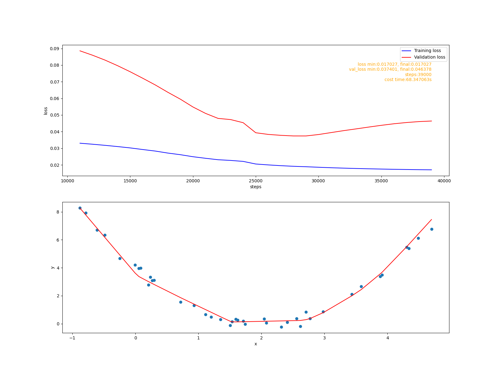
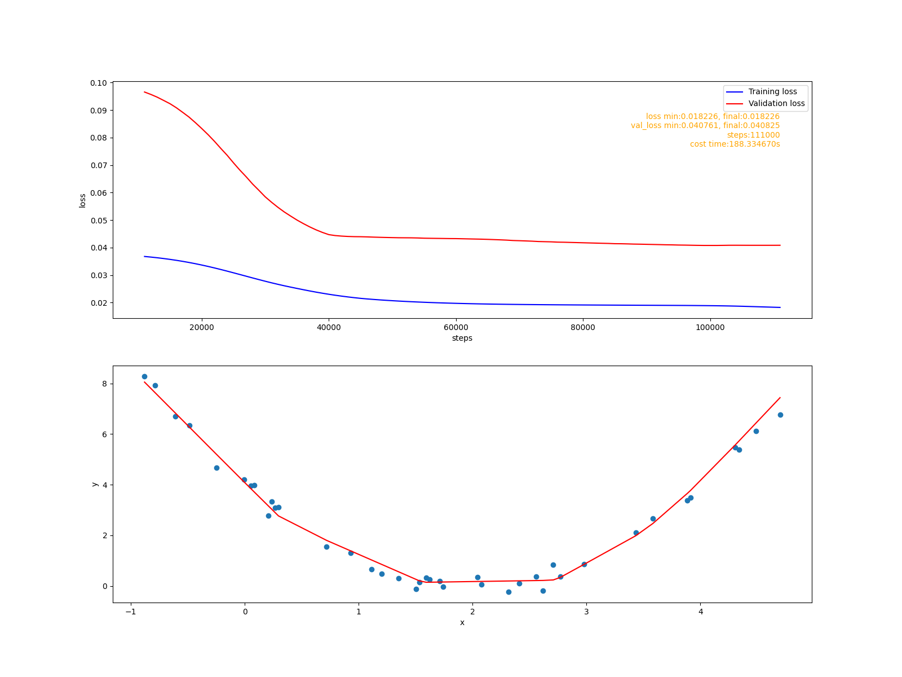
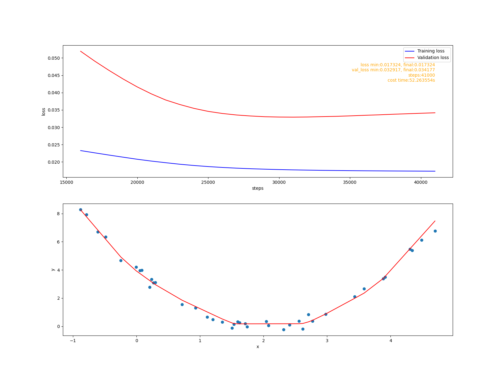

<script type="text/javascript" async src="https://cdn.mathjax.org/mathjax/latest/MathJax.js?config=TeX-MML-AM_CHTML"> </script>

# 目标
1. 为Session类增加自动分批训练模型的功能, 使框架更好用。
2. 新增缓解过拟合的算法: L2正则化, 随机丢弃。

# 实现自动分批训练
## 设计方案
- 增加Dataset类负责管理书数据集, 数据自动分批。
- 在Session类中增加fit方法, 使用Dataset得到数据, 使用事件机制告诉外界训练情况, 最后返回一个训练历史记录。
- 增加FitListener类, 用于监听fit方法训练过程中触发的事件。

## fit方法
定义:
```
fit(self, data, epochs, **kargs)
```
data: 训练数据集Dataset对象。
epochs: 训练轮数, 把data中的每一批数据遍历训练一次称为一轮。
kargs:
  val_data: 验证数据集。
  val_epochs: 执行验证的训练轮数. 每val_epochs伦训练验证一次。
  val_steps: 执行验证的训练步数. 每val_steps伦训练验证一次. 只有>0才有效, 优先级高于val_epochs。
  listeners: 事件监听器FitListener对象列表.

## fit方法触发的事件
- epoch_start: 每轮训练开始时触发。
- epoch_end: 每轮训练结束时触发。
- val_start: 每次执行验证时触发。
- val_end: 每次执行验证结束时触发。

训练过程中, fit方法会把触发的事件派发到所有的FitListener对象, FitListener对象自己决定处理或忽略。

## 训练历史记录(history)
&nbsp; &nbsp; &nbsp; &nbsp; history的格式:
```python
{
  'loss': [],
  'val_loss': [],
  'steps': [],
  'val_pred': darray,
  'cost_time': float
}
```
- loss: 记录训练误差。
- val_loss: 记录验证误差。loss会和val_loss同步记录。
- step: 每个误差记录对应的训练步数。
- val_pred: 最后一次执行验证时模型使用验证数据集预测的结果。
- cost_time: 整个训练过程花费的时间(s)。

## 代码
### fit方法实现
&nbsp; &nbsp; &nbsp; &nbsp; 代码文件: cutedl/session.py。
&nbsp; &nbsp; &nbsp; &nbsp; fit方法比较复杂, 先看主干代码:
```python
    #初始化训练历史数据结构
    history = {
        'loss': [],
        'val_loss': [],
        'steps': [],
        'val_pred': None,
        'cost_time': 0
    }
    #打开训练开关, 当调用stop_fit方法后会关闭这个开关, 停止训练。
    self.__fit_switch = True

    #得到参数
    val_data = kargs.get('val_data')
    val_epochs = kargs.get('val_epochs', 1)
    val_steps = kargs.get('val_steps', 0)
    listeners = kargs.get('listeners', [])

    if val_data is None:
        history['val_loss'] = None

    #计算将会训练的最大步数
    if val_epochs <= 0 or val_epochs >= epochs:
        val_epochs = 1

    if val_steps <= 0:
        val_steps = val_epochs * data.batch_count

      #开始训练
      step = 0
      history['cost_time'] = time.time()
      for epoch in range(epochs):
          if not self.__fit_switch:
              break

          #触发并派发事件
          event_dispatch("epoch_start")
          for batch_x, batch_y in data.as_iterator():
              if not self.__fit_switch:
                  break
              #pdb.set_trace()
              loss = self.batch_train(batch_x, batch_y)
              step += 1
              if step % val_steps == 0:
                  #使用验证数据集验证模型
                  event_dispatch("val_start")
                  val_loss, val_pred = validation()
                  record(loss, val_loss, val_pred, step)
                  event_dispatch("val_end")
                  #显示训练进度
                  display_progress(epoch+1, epochs, step, val_steps, loss, val_loss)
              else:
                  display_progress(epoch+1, epochs, step, val_steps, loss)

          event_dispatch("epoch_end")

      #记录训练耗时
      history['cost_time'] = time.time() - history['cost_time']

      return history
```
&nbsp; &nbsp; &nbsp; &nbsp; 主干代码中使用了些局部函数, 这些局部函数每个都是实现了一个小功能。

&nbsp; &nbsp; &nbsp; &nbsp; 派发事件:
```python
  def event_dispatch(event):
    #pdb.set_trace()
    for listener in listeners:
        listener(event, history)
```

&nbsp; &nbsp; &nbsp; &nbsp; 执行验证:
```python
  def validation():
    if val_data is None:
        return None, None

    val_pred = None #保存所有的预测结果
    losses = [] #保存所有的损失值
    #分批验证
    for batch_x, batch_y in val_data.as_iterator():
        #pdb.set_trace()
        y_pred = self.__model.predict(batch_x)
        loss = self.__loss(batch_y, y_pred)
        losses.append(loss)

        if val_pred is None:
            val_pred = y_pred
        else:
            val_pred = np.vstach((val_pred, y_pred))
    #计算平均损失
    loss = np.mean(np.array(losses))
    return loss, val_pred
```
&nbsp; &nbsp; &nbsp; &nbsp; 记录训练历史:
```python
  def record(loss, val_loss, val_pred, step):
    history['loss'].append(loss)
    history['steps'].append(step)

    if history['val_loss'] is not None and val_loss is not None :
        history['val_loss'].append(val_loss)
        history['val_pred'] = val_pred
```
&nbsp; &nbsp; &nbsp; &nbsp; 显示训练进度:
```python
    def display_progress(epoch, epochs, step, steps, loss, val_loss=-1):
      prog = (step % steps)/steps
      w = 20

      str_epochs = ("%0"+str(len(str(epochs)))+"d/%d")%(epoch, epochs)

      txt = (">"*(int(prog * w))) + (" "*w)
      txt = txt[:w]
      if val_loss < 0:
          txt = txt + (" loss=%f   "%loss)
          print("%s %s"%(str_epochs, txt), end='\r')
      else:
          txt = "loss=%f, val_loss=%f"%(loss, val_loss)
          print("")
          print("%s %s\n"%(str_epochs, txt))
```

# 实现L2正则化参数优化器
## 设计方案
- 增强Optimizer类的功能, 使之能够自己匹配要更新的参数。
- 实现给出L2正则化算法的Optimizer实现。
- 在Session类中增加对广义优化器的支持(L2优化器就是广义优化器)。

## 数学原理
&nbsp; &nbsp; &nbsp; &nbsp; 设模型每一层的损失函数为:
```math
J=f(XW+b)
```
&nbsp; &nbsp; &nbsp; &nbsp; X是数据, W是权重参数，b是偏移量参数. L2算法是在原损失函数上加上W范数平方的衰减量, 得到一个新的损失函数:
```math
J' = J + \frac{λ}{2}||W||^2
```
&nbsp; &nbsp; &nbsp; &nbsp; λ是衰减率, 相当于全局学习率的超参数。对于一个模型来说, 只有输出层的损失函数是明确知道的, 其他层是不明确的。不过没关系, 更新参数是在反向传播阶段，这个时候需要的是梯度, 并不关心原函数的形式, 新损失函数的梯度为:
```math
\frac{δ}{δW_i}J' = \frac{δ}{δW_i} J + λW_i
```
&nbsp; &nbsp; &nbsp; &nbsp; 其中
```math
\frac{δ}{δW_i} J
```
&nbsp; &nbsp; &nbsp; &nbsp; 可以在反向传播时候得到. 在梯度下降法训练模型时, 更新参数的表达式变成:
```math
W_i = W_i - (α\frac{δ}{δW_i} J + λW_i) = (1-λ)W_i - α\frac{δ}{δW_i} J, \quad \text{α是学习率}
```
&nbsp; &nbsp; &nbsp; &nbsp; 这个表达式的含义是: 在使用学习率更新参数之前，先把参数(W的范数)缩小到原来的(1-λ)倍。


## 代码
### 增强Optimizer功能
&nbsp; &nbsp; &nbsp; &nbsp; 代码文件: cutedl/optimizer.py
&nbsp; &nbsp; &nbsp; &nbsp; 修改__call__代码:
```python
def __call__(self, model):
      params = self.match(model)
      for p in params:
          self.update_param(model, p)
```
match方法用来把匹配名字匹配的参数过滤出来。
update_param方法实现实际的更新参数操作, 由子类实现。

&nbsp; &nbsp; &nbsp; &nbsp; match实现:
```python
  '''
  得到名字匹配pattern的参数
  '''
  def match(self, model):
      params = []
      rep = re.compile(self.pattern)
      for ly in model.layer_iterator():
          for p in ly.params:
              if rep.match(p.name) is None:
                  continue

              params.append(p)

      return params
```
&nbsp; &nbsp; &nbsp; &nbsp; 这个方法使用正则表达式通过参数名匹配参数, 并返回匹配的参数列表。pattern是正则表达式属性, 子类可以通过覆盖这个属性, 改变匹配行为。

### 实现L2正则化优化器
```python
'''
L2 正则化
'''
class L2(Optimizer):
    '''
    damping 参数衰减率
    '''
    def __init__(self, damping):
        self.__damping = damping

    def update_param(self, model, param):
        #pdb.set_trace()
        param.value = (1 - self.__damping) * param.value
```

### 在Session中支持广义参数优化器
&nbsp; &nbsp; &nbsp; &nbsp; 代码文件: cutedl/session.py。
&nbsp; &nbsp; &nbsp; &nbsp; 首先为__init__ 方法添加参数:
```python
'''
genoptms: list[Optimizer]对象, 广义参数优化器列表,
                  列表中的优化器将会在optimizer之前按顺序执行
'''
def __init__(self, model, loss, optimizer, genoptms=None):
  self.__genoptms = genoptms
```
&nbsp; &nbsp; &nbsp; &nbsp; 然后在batch_train方法中调用优化器:
```python
    #执行广义优化器更新参数
    if self.__genoptms is not None:
        for optm in self.__genoptms:
            optm(self.__model)
```


# 实现随机丢弃层: Dropout
## 数学原理
&nbsp; &nbsp; &nbsp; &nbsp; 向前传播的函数:
```math
Y_i = \frac{A_i}{p} X_i, \quad A_i服从参数为p的伯努利分布, p≠0.
```
&nbsp; &nbsp; &nbsp; &nbsp; p是我们要给出的常数。算法要使用p构造随机变量A, 使得A=1的概率为p, A=0的概率为1-p. 对这个函数的直观解释是: A将有1-p的概率被丢弃掉(置为0), p的概率被保留, 如果被保留, 它将会被拉伸1/p倍。 这个函数有一个很有用的性质, 它的输入和输出的均值不变:
```math
E(Y_i) = \frac{E(A_i)}{p} E(X_i) = \frac{p}{p} E(X_i) = E(X_i)
```
&nbsp; &nbsp; &nbsp; &nbsp; 传播的梯度为:
```math
\frac{δ}{δX_i} = \frac{A_i}{p}
```

## 代码
&nbsp; &nbsp; &nbsp; &nbsp; 代码文件: nn_layers.py。
&nbsp; &nbsp; &nbsp; &nbsp; Dropout类实现了随机丢弃算法。向前传播实现:
```python
def forward(self, in_batch, training=False):
    kp = self.__keep_prob
    #pdb.set_trace()
    if not training or kp <= 0 or kp>=1:
        return in_batch

    #生成[0, 1)直接的均价分布
    tmp = np.random.uniform(size=in_batch.shape)
    #保留/丢弃索引
    mark = (tmp <= kp).astype(int)
    #丢弃数据, 并拉伸保留数据
    out = (mark * in_batch)/kp

    self.__mark = mark

    return out
```
&nbsp; &nbsp; &nbsp; &nbsp; 随机丢弃层传入的参数是keep_prob保留概率, 这意味这丢弃的概率为1 - keep_prob. 只有处于训练状态且0<keep_prob<1才执行丢弃操作。代码中的变量mark就是用保留概率构造随机变量, 它是服从参数为keep_prob的伯努利随机变量。
&nbsp; &nbsp; &nbsp; &nbsp; 反向传播实现:
```python
def backward(self, gradient):
    #pdb.set_trace()
    if self.__mark is None:
        return gradient

    out = (self.__mark * gradient)/self.__keep_prob

    return out
```


# 验证
&nbsp; &nbsp; &nbsp; &nbsp; 目前阶段所需要的代码已经完成，现在我们来进行验证，验证代码位于: examples/mlp/linear-regression-1.py。

## 对比基准
&nbsp; &nbsp; &nbsp; &nbsp; 首先我们来构造一个欠拟合模型作为对比基准。
```python
'''
过拟合对比基准
'''
def fit0():
    print("fit0")
    model = Model([
        nn.Dense(128, inshape=1, activation='relu'),
        nn.Dense(256, activation='relu'),
        nn.Dense(1)
    ])
    model.assemble()

    sess = Session(model,
                loss=losses.Mse(),
                optimizer = optimizers.Fixed(),
            )

    history = sess.fit(ds, 200000, val_data=val_ds, val_epochs=1000,
                    listeners=[
                        FitListener('val_end', callback=lambda h:on_val_end(sess, h))
                        ]
                    )

    fit_report(history, report_path+'00.png', 10)
```
&nbsp; &nbsp; &nbsp; &nbsp; 可以看到这里不在需要自己写训练函数, 直接调用fit方法即可实现自动训练。on_val_end函数监听val_end事件, 它功能是在满是条件时调用Session的stop_fit方法停止训练, 这里停止训练的条件是。最初的10次验证过后, 检查每次验证的val_loss值, 如果连续10次没有变得更小就停止训练。
&nbsp; &nbsp; &nbsp; &nbsp; 拟合报告:


## 使用L2优化器缓解过拟合
```python
'''
使用L2正则化缓解过拟合
'''
def fit1():
    print("fit1")
    model = Model([
        nn.Dense(128, inshape=1, activation='relu'),
        nn.Dense(256, activation='relu'),
        nn.Dense(1)
    ])
    model.assemble()


    sess = Session(model,
                loss=losses.Mse(),
                optimizer = optimizers.Fixed(),
                #L2正则化
                genoptms = [optimizers.L2(0.00005)]
            )

    history = sess.fit(ds, 200000, val_data=val_ds, val_epochs=1000,
                    listeners=[
                        FitListener('val_end', callback=lambda h:on_val_end(sess, h))
                        ]
                    )
    fit_report(history, report_path+'01.png', 10)
```
&nbsp; &nbsp; &nbsp; &nbsp; 拟合报告:

&nbsp; &nbsp; &nbsp; &nbsp; 从训练损失值图像上看有明显的缓解迹象。

## 使用Dropout层缓解过拟合
```python
'''
使用dropout缓解过拟合
'''
def fit2():
    print("fit2")
    model = Model([
        nn.Dense(128, inshape=1, activation='relu'),
        nn.Dense(256, activation='relu'),
        nn.Dropout(0.80), #0.8的保留概率
        nn.Dense(1)
    ])
    model.assemble()

    sess = Session(model,
                loss=losses.Mse(),
                optimizer = optimizers.Fixed(),
            )

    history = sess.fit(ds, 200000, val_data=val_ds, val_epochs=1000,
                    listeners=[
                        FitListener('val_end', callback=lambda h:on_val_end(sess, h))
                        ]
                    )

    fit_report(history, report_path+'02.png', 15)
```
&nbsp; &nbsp; &nbsp; &nbsp; 拟合报告:

&nbsp; &nbsp; &nbsp; &nbsp; 从训练损失值图像上随机丢弃的效果更好一些。

## 同时使用L2和Dropout

# 总结
