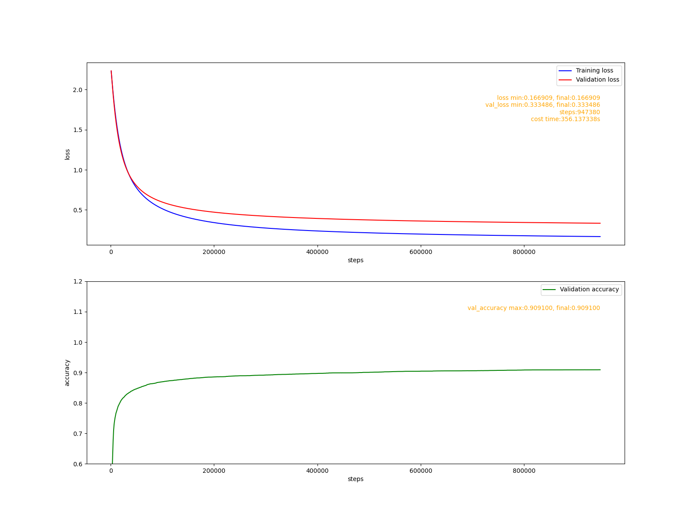

# 目标
1. 增加交叉熵损失函数，使框架能够支持分类任务的模型。
2. 构建一个MLP模型, 在mnist数据集上执行分类任务准确率达到91%。
<br>

# 实现交叉熵损失函数
## 数学原理
### 分解交叉熵损失函数
&nbsp; &nbsp; &nbsp; &nbsp; 交叉熵损失函数把模型的输出值当成一个离散随机变量的分布列。 设模型的输出为: $\hat{Y} = f(X)$, 其中$f(X)$表示模型。$\hat{Y}$是一个m X n矩阵, 如下所示:
$$
\begin{bmatrix}
  \hat{y}_{11} & \hat{y}_{12} & ... & \hat{y}_{1n} \\
  \hat{y}_{21} & \hat{y}_{22} & ... & \hat{y}_{2n} \\
  ... & ... & ... & ... \\
  \hat{y}_{m1} & \hat{y}_{m2} & ... & \hat{y}_{mn}
\end{bmatrix}
$$
&nbsp; &nbsp; &nbsp; &nbsp; 把这个矩阵的第i行记为$\hat{y}_i$, 它是一个$\R^{1Xn}$向量, 它的第j个元素记为$\hat{y}_{ij}$。
&nbsp; &nbsp; &nbsp; &nbsp; 交叉熵损失函数要求$\hat{y}_i$具有如下性质:
$$
\begin{matrix}
 0<=\hat{y}_{ij}<=1  & & (1)\\
 \sum_{j=1}^{n} \hat{y}_{ij} = 1, & n=2,3,... & (2)
\end{matrix}
$$
&nbsp; &nbsp; &nbsp; &nbsp; 特别地，当n=1时, 只需要满足第一条性质即可。我们先考虑n > 1的情况, 这种情况下n=2等价于n=1，在工程上n=1可以看成是对n=2的优化。
&nbsp; &nbsp; &nbsp; &nbsp; 模型有时候并不会保证输出值有这些性质, 这时损失函数要把$\hat{y}_i$转换成一个分布列:$\hat{p}_i$, 转换函数的定义如下:
$$
\begin{matrix}
  S_i = \sum_{j=1}^{n} e^{\hat{y}_{ij}}\\
  \hat{p}_{ij} = \frac{e^{\hat{y}_{ij}}}{S_i}
\end{matrix}
$$
&nbsp; &nbsp; &nbsp; &nbsp; 这里的$\hat{p}_i$是可以满足要求的。函数$e^{\hat{y}_{ij}}$是单调增函数，对于任意两个不同的$\hat{y}_{ia} < \hat{y}_{ib}$, 都有:$ e^{\hat{y}_{ia}} < e^{\hat{y}_{ib}}$, 从而得到:$\hat{p}_{ia} < \hat{p}_{ib}$. 因此这个函数把模型的输出值变成了概率值，且概率的大小关系和输出值的大小关系一致。
&nbsp; &nbsp; &nbsp; &nbsp; 设数据$x_i$的类别标签为$y_i ∈ \R^{1Xn}$. 如果$x_i$的真实类别为t, $y_i$满足:
$$
\begin{matrix}
  y_{ij} = 1 & {如果j=t} \\
  y_{ij} = 0 & {如果j≠t}
\end{matrix}
$$
&nbsp; &nbsp; &nbsp; &nbsp; $y_i$使用的是one-hot编码。交叉熵损失函数的定义为:
$$
J_i = \frac{1}{m} \sum_{j=1}^{n} -y_{ij}ln(\hat{p}_{ij})
$$
&nbsp; &nbsp; &nbsp; &nbsp; 对于任意的$y_{ij}$, 损失函数中任意一项具有如下的性质:
$$
\begin{matrix}
  -y_{ij}ln(\hat{p}_{ij}) ∈ [0, ∞), & 如果: y_{ij} = 1\\
  -y_{ij}ln(\hat{p}_{ij})=0, & 如果: y_{ij} = 0
\end{matrix}
$$
&nbsp; &nbsp; &nbsp; &nbsp; 可看出$y_{ij}=0$的项对损失函数的值不会产生影响，所以在计算时可以把这样的项从损失函数中忽略掉。其它$y_{ij}=1$的项当$\hat{p}_{ij}=y_{ij}=1$时损失函数达到最小值0。

### 梯度推导
&nbsp; &nbsp; &nbsp; &nbsp; 根据链式法则, 损失函数的梯度为:
$$
\frac{\partial J_i}{\partial \hat{y}_{ij}} = \frac{\partial J_i}{\partial \hat{p}_{ij}} \frac{\partial \hat{p}_{ij}}{\partial \hat{y}_{ij}},  \quad (1)
$$
&nbsp; &nbsp; &nbsp; &nbsp; 其中:
$$
\frac{\partial J_i}{\partial \hat{p}_{ij}} = \frac{1}{m} \frac{-y_{ij}}{\hat{p}_{ij}} \quad (2)
$$
$$
\frac{\partial \hat{p}_{ij}}{\partial \hat{y}_{ij}} = \frac{e^{\hat{y}_{ij}}S_i - e^{2\hat{y}_{ij}}}{S_i^2} = \frac{\hat{y}_{ij}}{S_i} - [\frac{e^{\hat{y}_{ij}}}{S_i}]^2 = \hat{p}_{ij} - (\hat{p}_{ij})^2 = \hat{p}_{ij}(1-\hat{p}_{ij}) \quad (3)
$$
&nbsp; &nbsp; &nbsp; &nbsp; 把(2), (3)代入(1)中得到:
$$
\frac{\partial J_i}{\partial \hat{y}_{ij}} = \frac{1}{m} \frac{-y_{ij}}{\hat{p}_{ij}} \hat{p}_{ij}(1-\hat{p}_{ij})
= \frac{1}{m}(y_{ij}\hat{p}_{ij} -y_{ij})
$$
&nbsp; &nbsp; &nbsp; &nbsp; 由于当$y_{ij}=0$时, 梯度值为0, 所以这种情况可以忽略, 最终得到的梯度为:
$$
\frac{\partial J_i}{\partial \hat{y}_{ij}} =  \frac{1}{m}(\hat{p}_{ij} -y_{ij})
$$
&nbsp; &nbsp; &nbsp; &nbsp; 如果模型的输出值是一个随机变量的分布列, 损失函数就可以省略掉把$\hat{y}_{ij}$转换成$\hat{p}_{ij}$的步骤, 这个时候$\hat{y}_{ij} = \hat{p}_{ij}$, 最终的梯度变成:
$$
\frac{\partial J_i}{\partial \hat{y}_{ij}} = \frac{\partial J_i}{\partial \hat{p}_{ij}} = - \frac{y_{ij}}{m\hat{y}_{ij}}
$$

<br>

### 交叉熵损失函数的特殊情况: 只有两个类别
&nbsp; &nbsp; &nbsp; &nbsp; 现在来讨论当n=1的情况, 这个时候$\hat{y}_i ∈ \R^{1 X 1}$，可以当成标量看待。
&nbsp; &nbsp; &nbsp; &nbsp; 如果模型输出的不是分布列, 损失函数可以分解为:
$$
\begin{matrix}
  \hat{p}_{i} = \frac{1}{1+e^{-\hat{y}_{i}}} \\
  \\
  J_i = \frac{1}{m}[-y_iln(\hat{p}_{i}) - (1-y_i)ln(1-\hat{p}_{i})]
\end{matrix}
$$
&nbsp; &nbsp; &nbsp; &nbsp; 损失函数关于输出值的梯度为:
$$
\frac{\partial J_i}{\partial \hat{p}_i} = \frac{1}{m}(-\frac{y_i}{\hat{p}_i} + \frac{1-y_i}{1 - \hat{p}_i}) = \frac{\hat{p}_i - y_i}{m\hat{p}_i(1-\hat{p}_i)}, \quad (1)
$$
$$
\frac{\partial \hat{p}_i}{\partial \hat{y}_i} = \frac{e^{-\hat{y}_{i}}}{(1+e^{-\hat{y}_{i}})^2} = \frac{1}{1+e^{-\hat{y}_{i}}} \frac{e^{-\hat{y}_{i}}}{1+e^{-\hat{y}_{i}}} =   \hat{p}_{i}(1-  \hat{p}_{i} ), \quad (2)
$$
$$
\frac{\partial J_i}{\partial \hat{y}_i} = \frac{\partial J_i}{\partial \hat{p}_i} \frac{\partial \hat{p}_i}{\partial \hat{y}_i}, \quad (3)
$$
&nbsp; &nbsp; &nbsp; &nbsp; 把(1),(2)代入(3)中得到:
$$
\frac{\partial J_i}{\partial \hat{y}_i} = \frac{\hat{p}_i - y_i}{m\hat{p}_i(1-\hat{p}_i)} \hat{p}_{i}(1-  \hat{p}_{i} ) = \frac{1}{m}(\hat{p}_i - y_i)
$$
&nbsp; &nbsp; &nbsp; &nbsp; 如果模型输出值时一个随机变量的分布列, 则有:
$$
\frac{\partial J_i}{\partial \hat{y}_i} = \frac{\partial J_i}{\partial \hat{p}_i} = \frac{\hat{y}_i - y_i}{m\hat{y}_i(1-\hat{y}_i)}
$$

<br>

## 实现代码
&nbsp; &nbsp; &nbsp; &nbsp; 这个两种交叉熵损失函数的实现代码在cutedl/losses.py中。一般的交叉熵损失函数类名为CategoricalCrossentropy, 其主要实现代码如下:
```python
  '''
  输入形状为(m, n)
  '''
  def __call__(self, y_true, y_pred):
      m = y_true.shape[0]
      #pdb.set_trace()
      if not self.__form_logists:
          #计算误差
          loss = (-y_true*np.log(y_pred)).sum(axis=0)/m
          #计算梯度
          self.__grad = -y_true/(m*y_pred)
          return loss.sum()

      m = y_true.shape[0]
      #转换成概率分布
      y_prob = dlmath.prob_distribution(y_pred)
      #pdb.set_trace()
      #计算误差
      loss = (-y_true*np.log(y_prob)).sum(axis=0)/m
      #计算梯度
      self.__grad  = (y_prob - y_true)/m

      return loss.sum()
```
&nbsp; &nbsp; &nbsp; &nbsp; 其中prob_distribution函数把模型输出转换成分布列, 实现方法如下:
```python
def prob_distribution(x):
    expval = np.exp(x)
    sum = expval.sum(axis=1).reshape(-1,1) + 1e-8

    prob_d = expval/sum

    return prob_d
```
&nbsp; &nbsp; &nbsp; &nbsp; 二元分类交叉熵损失函数类名为BinaryCrossentropy, 其主要实现代码如下:
```python
'''
输入形状为(m, 1)
'''
def __call__(self, y_true, y_pred):
    #pdb.set_trace()
    m = y_true.shape[0]

    if not self.__form_logists:
        #计算误差
        loss = (-y_true*np.log(y_pred)-(1-y_true)*np.log(1-y_pred))/m
        #计算梯度
        self.__grad = (y_pred - y_true)/(m*y_pred*(1-y_pred))
        return loss.sum()

    #转换成概率
    y_prob = dlmath.sigmoid(y_pred)
    #计算误差
    loss = (-y_true*np.log(y_prob) - (1-y_true)*np.log(1-y_prob))/m
    #计算梯度
    self.__grad = (y_prob - y_true)/m

    return loss.sum()
```
<br>

# 在MNIST数据集上验证
&nbsp; &nbsp; &nbsp; &nbsp; 现在使用MNIST分类任务验证交叉熵损失函数。代码位于examples/mlp/mnist-recognize.py文件中. 运行这个代码前先把原始的MNIST数据集下载到examples/datasets/下并解压. 数据集下载链接为：https://pan.baidu.com/s/1CmYYLyLJ87M8wH2iQWrrFA，密码: 1rgr

&nbsp; &nbsp; &nbsp; &nbsp; 模型训练参数如下:
```python
'''
训练模型
'''
def fit0():
    lr = 0.0001
    print("fit1 lr:", lr)
    fit('0.png', optimizers.Fixed(lr))
```
&nbsp; &nbsp; &nbsp; &nbsp; 拟合报告:

&nbsp; &nbsp; &nbsp; &nbsp; 可以看出，将近100万步, 用时6分钟左右的训练，模型准确率达到了91%。同样的模型在tensorflow(CPU版)中经过几万步20秒左右的训练即可达到91%。这说明, cute-dl框架在任务性能上是没问题的，但训练模型的速度欠佳。
<br>

# 总结
&nbsp; &nbsp; &nbsp; &nbsp; 这个阶段框架实现了对分类任务的支持, 在MNIST数据集上验证模型性能达到预期。模型训练的速度并不令人满意。
&nbsp; &nbsp; &nbsp; &nbsp; 下个阶段，将会给模型添加学习率优化器, 在不损失泛化能力的同时加快模型训练速度。
