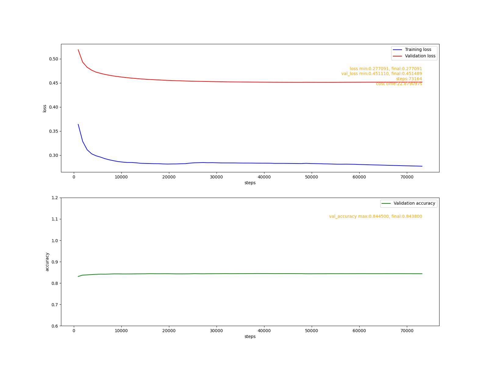
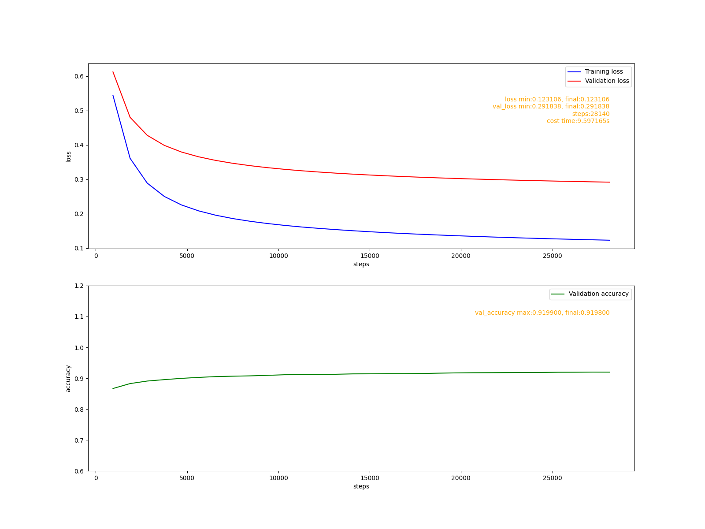
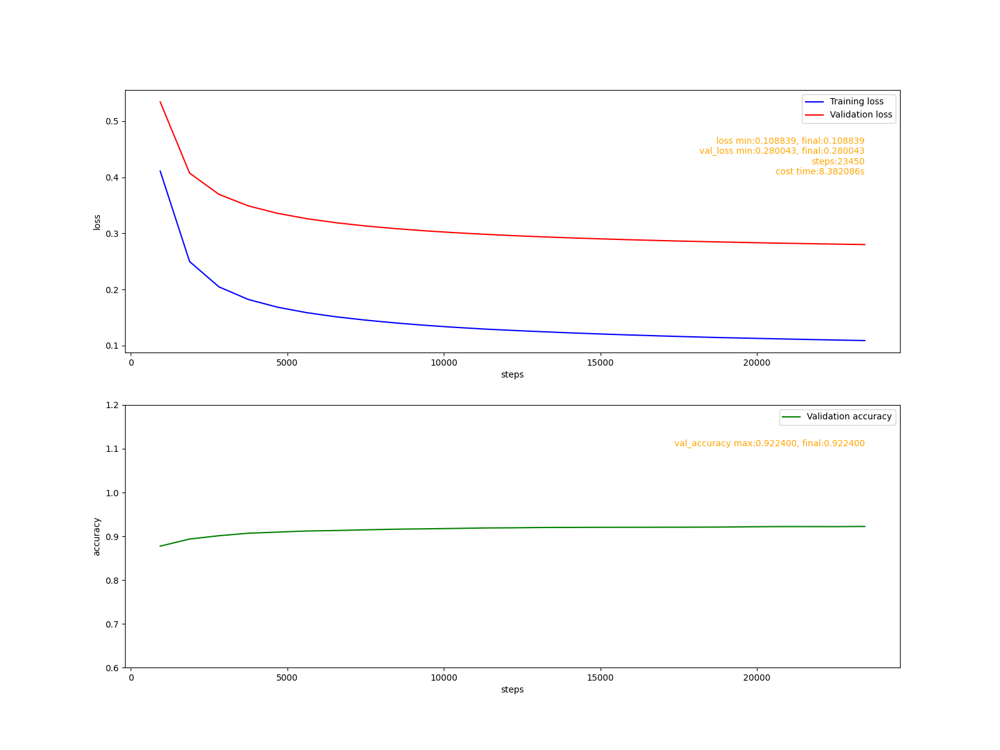
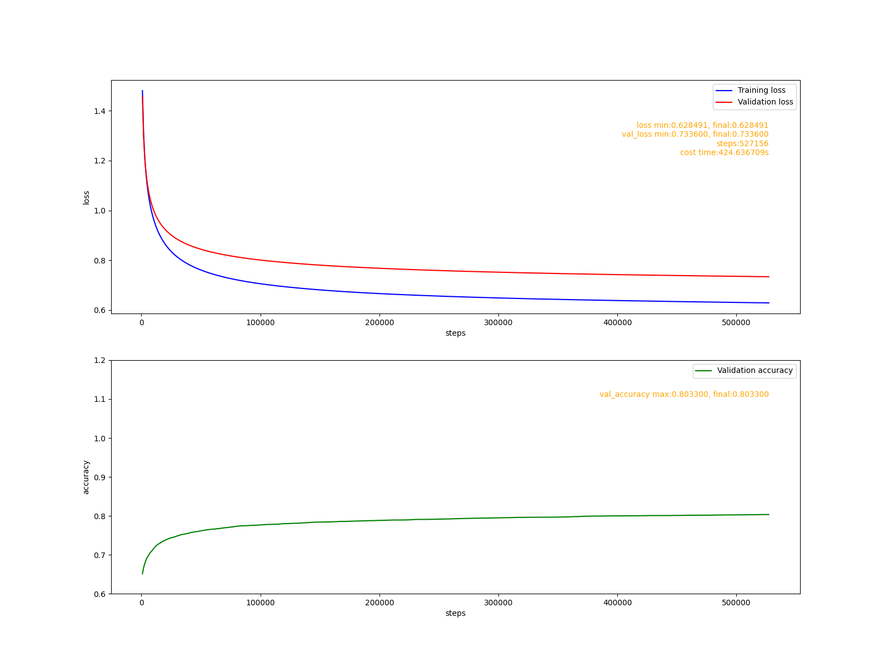
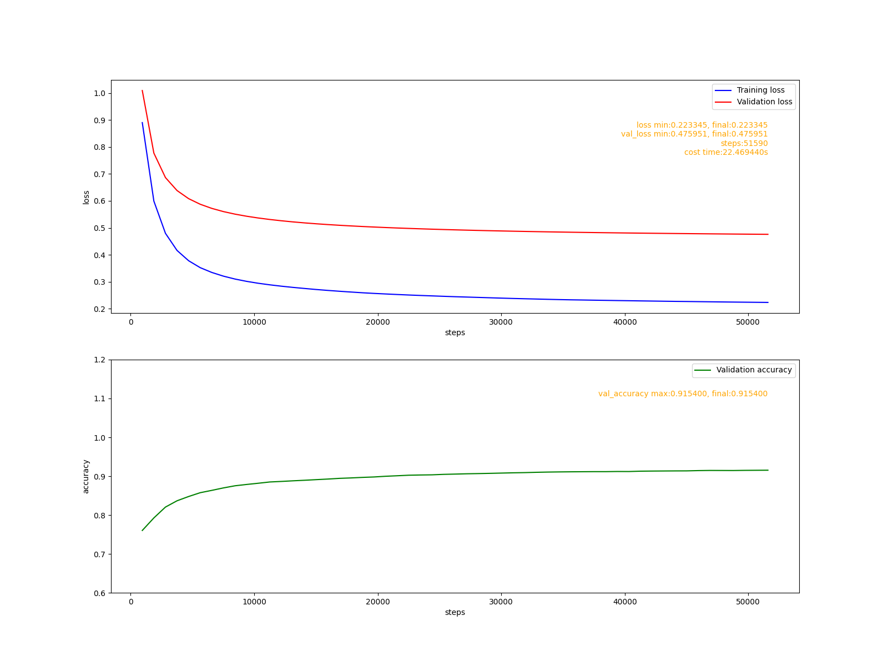
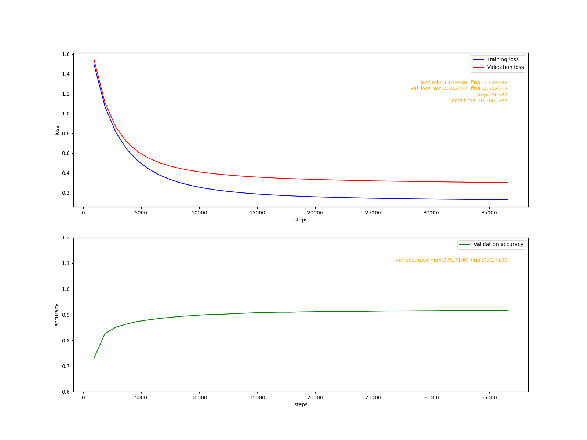
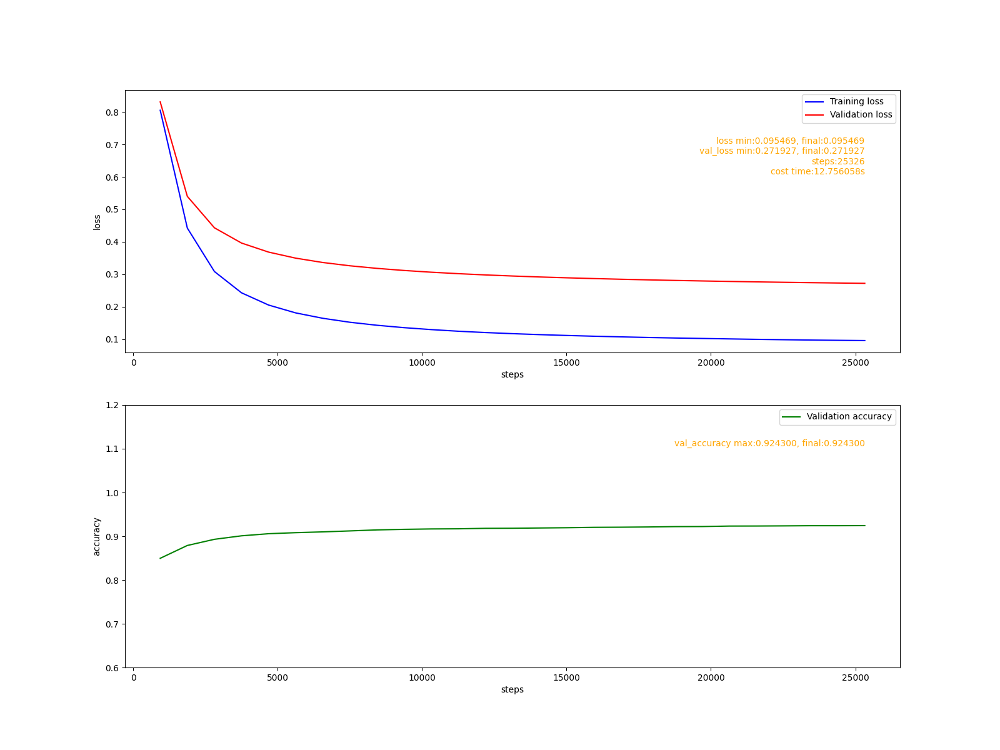

# 目标
1. 增加学习率优化器, 加快模型在小学习率下模型的训练速度。
2. 使用MNIST数据集比较同一个模型使用不同学习率优化器的表现。

# 常见的学习率优化算法
&nbsp; &nbsp; &nbsp; &nbsp; 在上个阶段，我们使用固定学习率优化器训练识别MNIST手写数字模型。在后面的示例中将会看到: 如果学习习设置太大，模型将无法收敛; 如果设置学习率太小模型大概率会收敛速度会非常缓慢。因此必须要要给学习率设置一个合适的值，这个合适的值到底是什么需要反复试验。
&nbsp; &nbsp; &nbsp; &nbsp; 训练模型的本质是，在由损失函数定义的高纬超平面中尽可能地找到最低点。由于高纬超平面十分复杂，找到全局最低点往往不现实，因此找到一个尽量接近全局最低点的局部最低点也是可以的。
&nbsp; &nbsp; &nbsp; &nbsp; 由于模型参数是随机初始化的，在训练的初始阶段, 可能远离最低点，也可能距最低点较较近。为了使模型能够收敛，较小的学习率比较大的学习率更有可能达到目地, 至少不会使模型发散。
&nbsp; &nbsp; &nbsp; &nbsp; 理想的状态下，我们希望，学习率是动态的: 在远离最低点的时候有较大的学习率，在靠近最低点的时候有较小的学习率。
&nbsp; &nbsp; &nbsp; &nbsp; 学习率算法在训练过程中动态调整学习率，试图使学习率接近理想状态。常见的学习率优化算法有:
- 动量算法。
- Adagrad算法。
- RMSProp算法。
- Adadelta算法。
- Adam算法。

&nbsp; &nbsp; &nbsp; &nbsp; 目前没有一种理论能够给出定量的结论断言一种算法比另一种更好，具体选用哪种算法视具体情况而定。
&nbsp; &nbsp; &nbsp; &nbsp; 接下来将会详细讨论每种算法的数学性质及实现，为了方便讨论，先给出一些统一的定义:
- 模型经历一次向前传播和一次反向传播称训练称为一次迭代。用t表示模型当前的迭代次数，t=0,1,2,...。 当t=0是表示模型处于初始状态。
- g表示反向传播的梯度, $g_t$是第t次迭的梯度。其他量的表示方式和g相同。
- w表示模型学习的参数。α表示学习率超参数。
- 符号a ⊙ v如果a和v都是向量, a, v必须有相同的维度a ⊙ v表示他们相同位置上的元素相乘，结果是和a,v具有相同维度的向量. 如果a是标量v是向量a ⊙ v表示向量的标量乘法等价于av。

# 动量算法
## 数学原理
$$
\begin{matrix}
  v_t = v_{t-1}γ + αg_t  \\
  w = w - v_t\\
\end{matrix}
$$
&nbsp; &nbsp; &nbsp; &nbsp; 其中v是动量$v_0=0$, γ是动量的衰减率$γ∈(0,1)$. 现在把$v_t$展开看一下$g_i, i=1,2,...t$对v_t的影响.
$$
v_t = α(γ^{t-1}g_1 + γ^{t-2}g_2 + ... + γg_{t-1} + g_t)
$$
&nbsp; &nbsp; &nbsp; &nbsp; 个项系数之和的极限情况:
$$
\lim_{t \to ∞} \sum_{i=1}^t γ^{t-i} = \frac{1}{1-γ}
$$
&nbsp; &nbsp; &nbsp; &nbsp; 令$t=\frac{1}{1-γ}$则有$\frac{1}{t}=1-γ$, $g_i$的指数加权平均值可用下式表示:
$$
\bar v_t = \frac{1}{t}(γ^{t-1}g_1 + γ^{t-2}g_2 + ... + γg_{t-1} + g_t) = (1-γ)(γ^{t-1}g_1 + γ^{t-2}g_2 + ... + γg_{t-1} + g_t)
$$
&nbsp; &nbsp; &nbsp; &nbsp; 如果把学习率α表示为:$α=\frac{α}{1-γ}(1-γ)$，因此$v_t$可以看成是最近的$1-γ$次迭代梯度的指数加权平均乘以一个缩放量$\frac{α}{1-γ}$, 这里的缩放量$\frac{α}{1-γ}$才是真正的学习率参数。
&nbsp; &nbsp; &nbsp; &nbsp; 设$\frac{1}{1-γ}=n$, 最近n次迭代梯度的权重占总权重的比例为:
$$
(\sum_{i=1}^{n} γ^i) / \frac{1}{1-γ} = \frac{\frac{1-γ^n}{1-γ}}{\frac{1}{1-γ}} = 1-γ^n = 1 - γ^{\frac{1}{1-γ}}
$$
&nbsp; &nbsp; &nbsp; &nbsp; 当γ=0.9时, $1 - γ^{10}≈0.651$, 就是说, 这个时候, 最近的10次迭代占总权重的比例约为65.1%, 换言之$v_t$的值的数量级由最近10次迭代权重值决定。
&nbsp; &nbsp; &nbsp; &nbsp; 当我们设置超参数γ,α时, 可以认为取了最近$\frac{1}{1-γ}$次迭代梯度的指数加权平均值为动量积累量，然后对这个积累量作$\frac{α}{1-γ}$倍的缩放。 例如: γ=0.9, α=0.01, 表示取最近10次的加权平均值，然后将这个值缩小到原来的0.1倍。
&nbsp; &nbsp; &nbsp; &nbsp; 动量算法能够有效地缓解$g_t \to 0$时参数更新缓慢的问题和当$g_t$很大时参数更新幅度过大的问题。
&nbsp; &nbsp; &nbsp; &nbsp; 比较原始的梯度下降算法和使用动量的梯度下降算法更新参数的情况:
$$
\begin{matrix}
 w = w - αg_t & (1) & 原始梯度下降算法 \\
 w = w - v_t & (2) & 动量算法
\end{matrix}
$$
&nbsp; &nbsp; &nbsp; &nbsp; $g_t \to 0$时, 有3种可能:
1. 当前位置是超平面的一个全局最低点。是期望的理想收敛位置，(1)式会停止更新参数, （2)式会使参数在这个位置周围以越来越小的幅度震荡, 最终收敛到这个位置。
2. 当前位置是超平面的一个局部最低点。(1)式会停留在这个位置, 最终学习到一个不理想的参数。(2)式中$v_t$由于积累了最近n步的势能, 会冲过这个区域, 继续寻找更优解。
3. 当前位置是超平面的一个鞍点。 (1)式会停留在这个位置, 最终学习到一个不可用的参数。(2)式中$v_t$由于记录了最近n步的势能, 会冲过这个区域, 继续寻找更优解

&nbsp; &nbsp; &nbsp; &nbsp; 当$g_t$很大时(1)式导致参数大幅度的更新, 会大概率导致模型发散。(2)式当γ=0.9时, $g_t$对$v_t$的影响权重是0.1; 式当γ=0.99时，$g_t$对$v_t$的影响权重是0.01, 相比于$g_{t-1}$到$g_t$的增加幅度, $v_{t-1}$到$v_t$增加幅度要小的多, 参数更新也会平滑许多。

## 实现
&nbsp; &nbsp; &nbsp; &nbsp; 文件: cutedl/optimizers.py, 类名:Momentum.
```python
  def update_param(self, param):
      #pdb.set_trace()
      if not hasattr(param, 'momentum'):
          #为参数添加动量属性
          param.momentum = np.zeros(param.value.shape)

      param.momentum = param.momentum * self.__dpr + param.gradient * self.__lr

      param.value -= param.momentum
```

# Adagrad算法
## 数学原理
$$
\begin{matrix}
s_t  = s_{t-1} + g_t ⊙ g_t  \\
Δw_t = \frac{α}{\sqrt{s_t} + ε}  ⊙ g_t  \\
w = w - Δw_t
\end{matrix}
$$
&nbsp; &nbsp; &nbsp; &nbsp; 其中$s_t$是梯度平方的积累量, $ε=10^{-6}$用来保持数值的稳定, Δw_t是参数的变化量。$s_t$的每个元素都是正数, 随着迭代次数增加, 数值会越来越大，相应地$\frac{α}{\sqrt{s_t} + ε}$的值会越来越小。$\frac{α}{\sqrt{s_t} + ε}$相当于为$g_t$中的每个元素计算独立的的学习率, 使$Δw_t$中的每个元素位于(-1, 1)区间内，随着训练次数的增加会向0收敛。这意味着$||Δw_t||$会越来越小, 迭代次数比较大时, $||Δw_t|| \to 0$, 参数w将不会有更新。相比于动量算法, Adagrad算法调整学习率的方向比较单一, 只会往更小的方向上调整。α不能设置较大的值, 因为在训练初期$s_t$的值会很小, $\frac{α}{\sqrt{s_t} + ε}$会放大α的值, 导致较大的学习率，从而导致模型发散。

## 实现
&nbsp; &nbsp; &nbsp; &nbsp; 文件: cutedl/optimizers.py, 类名:Adagrad.
```python
  def update_param(self, param):
      #pdb.set_trace()
      if  not hasattr(param, 'adagrad'):
          #添加积累量属性
          param.adagrad = np.zeros(param.value.shape)

      a = 1e-6
      param.adagrad += param.gradient ** 2
      grad = self.__lr/(np.sqrt(param.adagrad) + a) * param.gradient
      param.value -= grad
```

# RMSProp算法
## 数学原理
&nbsp; &nbsp; &nbsp; &nbsp; 为了克服Adagrad积累量不断增加导致学习率会趋近于0的缺陷, RMSProp算法的设计在Adagrad的基础上引入了动量思想。
$$
\begin{matrix}
s_t  = s_{t-1}γ + g_t ⊙ g_t(1-γ)  \\
Δw_t = \frac{α}{\sqrt{s_t} + ε}  ⊙ g_t  \\
w = w - Δw_t
\end{matrix}
$$
&nbsp; &nbsp; &nbsp; &nbsp; 算法设计者给出的推荐参数是γ=0.99, 即$s_t$是最近100次迭代梯度平方的积累量, 由于计算变化量时使用的是$\sqrt{s_t}$, 对变化量的影响只相当于最近10次的梯度积累量。
&nbsp; &nbsp; &nbsp; &nbsp; 的Adagrad类似, $s_t$对$g_t$的方向影响较小, 但对$||g_t||$大小影响较大，会把它缩小到(-1, 1)区间内, 不同的是不会单调地把$||g_t||$收敛到0, 从而克服了Adagrad的缺陷。

## 实现
&nbsp; &nbsp; &nbsp; &nbsp; 文件: cutedl/optimizers.py, 类名:RMSProp.
```python
  def update_param(self, param):
      #pdb.set_trace()
      if not hasattr(param, 'rmsprop_storeup'):
          #添加积累量属性
          param.rmsprop_storeup = np.zeros(param.value.shape)

      a = 1e-6

      param.rmsprop_storeup = param.rmsprop_storeup * self.__sdpr + (param.gradient**2) * (1-self.__sdpr)
      grad = self.__lr/(np.sqrt(param.rmsprop_storeup) + a) * param.gradient

      param.value -= grad
```

# Adadelta算法
## 数学原理
&nbsp; &nbsp; &nbsp; &nbsp; 这个算法的最大特点是不需要全局学习率超参数, 它也引入了动量思想，使用变化量平方的积累量和梯度平方的积累量共同为$g_t$的每个元素计算独立的学习率。
$$
\begin{matrix}
s_t  = s_{t-1}γ + g_t ⊙ g_t(1-γ)  \\
Δw_t = \frac{\sqrt{d_{t-1}} + ε}{\sqrt{s_t} + ε}  ⊙ g_t  \\
d_t = d_{t-1}γ + Δw_t ⊙ Δw_t(1-γ)\\
w = w - Δw_t
\end{matrix}
$$
&nbsp; &nbsp; &nbsp; &nbsp; 这个算法引入了新的量$d_t$, 是变化量平方的积累量, 表示最近n次迭代的参数变化量平方的加权平均. $ε=10^{-6}$. 推荐的超参数值是γ=0.99。这个算法和RMSProp类似, 只是用$\sqrt{d_{t-1}}$代替了学习率超参数α。

## 实现
&nbsp; &nbsp; &nbsp; &nbsp; 文件: cutedl/optimizers.py, 类名:Adadelta.
```python
  def update_param(self, param):
      #pdb.set_trace()
      if not hasattr(param, 'adadelta_storeup'):
          #添加积累量属性
          param.adadelta_storeup = np.zeros(param.value.shape)

      if not hasattr(param, "adadelta_predelta"):
          #添加上步的变化量属性
          param.adadelta_predelta = np.zeros(param.value.shape)

      a = 1e-6

      param.adadelta_storeup = param.adadelta_storeup * self.__dpr + (param.gradient**2)*(1-self.__dpr)
      grad = (np.sqrt(param.adadelta_predelta)+a)/(np.sqrt(param.adadelta_storeup)+a) * param.gradient
      param.adadelta_predelta = param.adadelta_predelta * self.__dpr + (grad**2)*(1-self.__dpr)

      param.value -= grad
```

# Adam算法
## 数学原理
&nbsp; &nbsp; &nbsp; &nbsp; 前面讨论的Adagrad, RMSProp和Adadetal算法, 他们使用的加权平均积累量对$g_t$的范数影响较大, 对$g_t$的方向影响较小, 另外它们也不能缓解$g_t \to 0$的情况。Adam算法同时引入梯度动量和梯度平方动量，理论上可以克服前面三种算法共有的缺陷的缺陷。
$$
\begin{matrix}
v_t = v_{t-1}γ_1 + g_t(1-γ_1) \\
s_t  = s_{t-1}γ_2 + g_t ⊙ g_t(1-γ_2)  \\
\hat{v_t} = \frac{v_t}{1 - γ_1^t} \\
\hat{s_t} = \frac{s_t}{1 - γ_2^t} \\
Δw_t =  \frac{α\hat{v_t}}{\sqrt{s_t} + ε}  \\
w = w - Δw_t
\end{matrix}
$$
&nbsp; &nbsp; &nbsp; &nbsp; 其中$v_t$和动量算法中的$v_t$含义一样，$s_t$和RMSProp算法的$s_t$含义一样, 对应的超参数也有一样的推荐值$γ_1=0.9$, $γ_2=0.99$。用于稳定数值的$ε=10^{-8}$. 比较特别的是$\hat{v_t}$和$\hat{s_t}$, 他们是对$v_t$和$s_t$的一个修正。以$\hat{v_t}$为例, 当t比较小的时候, $\hat{v_t}$近似于最近$\frac{1}{1-γ}$次迭代梯度的加权和而不是加权平均, 当t比较大时, $1-γ^t \to 1$, 从而使$\hat{v_t} \to v_t$。也就是所$\hat{v_t}$时对对迭代次数较少时$v_t$值的修正, 防止在模型训练的开始阶段产生太小的学习率。$\hat{s_t}$的作用和$\hat{v_t}$是类似的。

## 实现
&nbsp; &nbsp; &nbsp; &nbsp; 文件: cutedl/optimizers.py, 类名:Adam.
```python
  def update_param(self, param):
      #pdb.set_trace()
      if not hasattr(param, 'adam_momentum'):
          #添加动量属性
          param.adam_momentum = np.zeros(param.value.shape)

      if not hasattr(param, 'adam_mdpr_t'):
          #mdpr的t次方
          param.adam_mdpr_t = 1

      if not hasattr(param, 'adam_storeup'):
          #添加积累量属性
          param.adam_storeup = np.zeros(param.value.shape)

      if not hasattr(param, 'adam_sdpr_t'):
          #动量sdpr的t次方
          param.adam_sdpr_t = 1

      a = 1e-8
      #计算动量
      param.adam_momentum = param.adam_momentum * self.__mdpr + param.gradient * (1-self.__mdpr)
      #偏差修正
      param.adam_mdpr_t *= self.__mdpr
      momentum = param.adam_momentum/(1-param.adam_mdpr_t)

      #计算积累量
      param.adam_storeup = param.adam_storeup * self.__sdpr + (param.gradient**2) * (1-self.__sdpr)
      #偏差修正
      param.adam_sdpr_t *= self.__sdpr
      storeup = param.adam_storeup/(1-param.adam_sdpr_t)

      grad = self.__lr * momentum/(np.sqrt(storeup)+a)
      param.value -= grad
```

# 不同学习率对训练模型的影响
&nbsp; &nbsp; &nbsp; &nbsp; 接下来我们仍然使用上个阶段的模型做为示例, 使用不同的优化算法训练模型，对比差别。代码在examples/mlp/mnist-recognize.py中
&nbsp; &nbsp; &nbsp; &nbsp; 代码中有两个结束训练的条件:
1. 连续20次验证没有得到更小的验证误差，表示模型模型已经无法进一步优化或者已经开始发散了，结束训练。
2. 连续20次验证模型验证正确率都在91%以上，表示模型性能已经达到预期目标且是收敛的，结束训练。

## 不使用优化算法的情况
### 使用较小的学习率
```python
  def fit0():
    lr = 0.0001
    print("fit1 lr:", lr)
    fit('0.png', optimizers.Fixed(lr))
```

&nbsp; &nbsp; &nbsp; &nbsp; 较小的的固定学习率0.0001可以使模型稳定地收敛，但收敛速度很慢, 这个训练过程达到了100万步。

### 使用较大的学习率
```python
def fit1():
    lr = 0.2
    print("fit0 lr:", lr)
    fit('1.png', optimizers.Fixed(lr))
```

&nbsp; &nbsp; &nbsp; &nbsp; 较大的固定学习率0.2, 模型在训练7万步左右的时候因发散而停止训练。模型进度开始降低: 最大验证正确率为:0.8445, 结束时的验证正确率为:0.8438.

### 适当的学习率
```python
def fit2():
    lr = 0.01
    print("fit2 lr:", lr)
    fit('2.png', optimizers.Fixed(lr))
```

&nbsp; &nbsp; &nbsp; &nbsp; 通过多次试验, 找到了一个合适的学习率0.01, 这时模型只需训练28000步左右即可达到期望性能。


## 动量算法优化器
```python
def fit_use_momentum():
    lr = 0.002
    dpr = 0.9
    print("fit_use_momentum lr=%f, dpr:%f"%(lr, dpr))
    fit('momentum.png', optimizers.Momentum(lr, dpr))
```

&nbsp; &nbsp; &nbsp; &nbsp; 这里的真实学习率为$\frac{0.002}{1-0.9} = 0.02$。模型训练23000步左右即可达到期望性能。这里的学习率稍大，证明动量算法可以适应稍大学习率的数学性质。

## Adagrad算法优化器
```python
def fit_use_adagrad():
    lr = 0.001
    print("fit_use_adagrad lr=%f"%lr)
    fit('adagrad.png', optimizers.Adagrad(lr))
```

&nbsp; &nbsp; &nbsp; &nbsp; 多次试验表明，Adagrad算法的参数最不好调。由于这个算法的学习率会一直单调递减, 它只能对模型进行小幅度的优化, 故而这个算法并不适合从头开始训练模型，比较适合对预训练的模型参数进行微调。

## RMSProp算法优化器
```python
def fit_use_rmsprop():
    sdpr = 0.99
    lr=0.0001
    print("fit_use_rmsprop lr=%f sdpr=%f"%(lr, sdpr))
    fit('rmsprop.png', optimizers.RMSProp(lr, sdpr))
```

&nbsp; &nbsp; &nbsp; &nbsp; 这里给出的是较小的学习率0.0001。多次试验表明, RMSProp在较大学习率下很容易发散，而在较小学习率下通常会有稳定的良好表现。

## Adadelta算法优化器
```python
def fit_use_adadelta():
    dpr = 0.99
    print("fit_use_adadelta dpr=%f"%dpr)
    fit('adadelta.png', optimizers.Adadelta(dpr))
```

&nbsp; &nbsp; &nbsp; &nbsp; 这个算法不需要给出学习率参数。多次试验显示, 在这个简单模型上, Adadelta算法表现得非常稳定。

## Adam算法优化器
```python
def fit_use_adam():
    lr = 0.0001
    mdpr = 0.9
    sdpr = 0.99
    print("fit_use_adam lr=%f, mdpr=%f, sdpr=%f"%(lr, mdpr, sdpr))
    fit('adam.png', optimizers.Adam(lr, mdpr, sdpr))
```

&nbsp; &nbsp; &nbsp; &nbsp; 只用这个算法在较小学习率0.0001的情况下20000步左右即可完成训练且最终达到了92.4%的验证准确率。


# 总结
&nbsp; &nbsp; &nbsp; &nbsp; 这个阶段为框架添加了常见的学习率优化算法，并在同一个模型上进行验证，对比。我发现即使不使用优化算法，用固定的学习率, 只要给出“合适”的学习率参数，仍然能够得到理想的训练速度, 但很难确定怎样才算“适合”。 学习率算法给出了参数调整的大致方向，一般来说较小的学习率都不会有问题，至少不会使模型发散，然后可以通过调整衰减率来加快训练速度，而衰减率有比较简单数学性质可以让我们在调整它的时知道这样调整意味着什么。
&nbsp; &nbsp; &nbsp; &nbsp; 目前为止cute-dl框架已经实现了对简单MLP模型的全面支持，接下来将会为框架添一些层，让它能够支持卷积神经网络模型。
