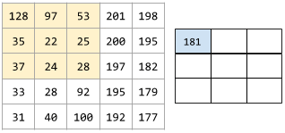

# 目标
&nbsp; &nbsp; &nbsp; &nbsp; 上个阶段使用MLP模型在在MNIST数据集上实现了92%左右的准确率，达到了tensorflow同等模型的水平。这个阶段要使用CNN模型在MNIST和CIFA10数据是验证框架，具体来说要达到如下目标:
1. 在MNIST数据集上达到99%以上的准确率。
2. 在CIFA10数据集上达到70%以上在准确率。
3. 直观地观察卷积层在预测阶段捕捉到的图像特征。
4. 讨论进一步提高CIFA10数据集上模型准确率的方法。

# 卷积层的设计和实现
## 卷积运算
&nbsp; &nbsp; &nbsp; &nbsp; 卷积运算有两个关键要素: 卷积核(过滤器), 卷积运算步长。如果卷积运算的目标是二维的那么卷积核可以用矩阵表示，卷积运算步长可以用二维向量。例如用kernel_size=(3,3)表示卷积核的尺寸，strides=(1,1)表示卷积运算的步长, 假如卷积核是这样的:

&nbsp; &nbsp; &nbsp; &nbsp; 可以把它看成$\R^{3 X 3}$矩阵。在步长strides=(1,1)的情况下卷积运算如下所示:

&nbsp; &nbsp; &nbsp; &nbsp; 其中
$$
\begin{matrix}
128*0 + 97*1 + 53*0 + 35*1 + 22*0 + 25*1 + 37*0 + 24*1 + 28 * 0 = 181 \\
97*0 + 53*1 + 201*0 + 22*1 + 25*0 + 200*1 + 24*0 + 28*1 + 197 * 0 = 303 \\
... \\
\\
28*0 + 197*1 + 182*0 + 92*1 + 195*0 + 179*1 + 100*0 + 192*1 + 177 * 0 = 660
\end{matrix}
$$
&nbsp; &nbsp; &nbsp; &nbsp;**(注意示意图中最后次运算计算有误应该是660)**
&nbsp; &nbsp; &nbsp; &nbsp; 这个卷积运算输入的是一个高h=5, 宽w=5的特征图, 卷积运算输出的是一个高h_=3, 宽w__=3的特征图。 如果已知w, h, kernel_size=$(h_k, w_k)$, strides=$(h_s, w_s)$, 那么输出特征图的高和宽分别为:
$$
 \begin{matrix}
  h\_ = \frac{h - h_k}{h_s} + 1 \\
  w\_= \frac{w - w_k}{w_s} + 1 \\
  \\
  h, w, h_k, w_k, h_s, w_s \text{都是正整数,}, 1<=h_k<h, 1<=w_k<w,  h\_, w\_向下取整
 \end{matrix}
$$
&nbsp; &nbsp; &nbsp; &nbsp; 由上面两个等式可以得出: h_ <= h, w_ <= w。经过卷积运算后特征图会变小。

## 卷积层设计
&nbsp; &nbsp; &nbsp; &nbsp; 卷积层的设计主要考虑以下几个问题:
1. 输入层的图像数据可能有多个(颜色)通道, 卷积层要能够处理多通道的输入。
2. 当叠加多个卷积层时，一般情况下特征图会逐层变小, 可以叠加的层数很少。卷积层要能够通过填充改变输入特征图的大小, 控制输出特征图的大小。
3. 如果用循环实现卷积运算, 会导致性能很低, 要把卷积运算转换成矩阵运算。
4. 卷积层输出的特征图最后会输入到全连接层中, 而全连接层值只支持矩阵输入，因此需要一个过渡层把特征图展平成矩阵。

### 初始化参数
&nbsp; &nbsp; &nbsp; &nbsp; 卷积层输入是特征图，它的形状为(m,c,h,w), 其中m是批次大小，c是通道数，h,w分别为特征图的高、宽。输出也是特征图，形状为(m,c_,h_,w_)。前面已经给出了h_和h, w_和w的关系，已知h,w情况下确定h_,w_还需要给出$h_k,w_k, h_s, w_s$, c_是独立的量，可以根据需要设置。因此卷积层初始化时需要给出层参数有卷积核大小kernel_size=$(h_k, w_k)$, 卷积运算步长strides=$(h_s, w_s)$, 输出通道数c_。 另外还需要padding参数指定填充方式来控制输出特征图的大小。

### 填充
&nbsp; &nbsp; &nbsp; &nbsp; 一般情况下, 特征图经过卷积层时会缩小，当h=h_时, 则有:
$$
h_k = h(1-h_s) + hs
$$
&nbsp; &nbsp; &nbsp; &nbsp; 其中 0 <$h_s$ < h, 只有当$h_s$=1时这个等式才有意义, $h_k=1$。同理可以得到当w=w_时, $w_k=w_s=1$。因此在没有填充的情况下如果要得到大小不变的输出，必须把卷积核设置成kernel_size=(1,1), 步长设置成strides=(1,1), 这限制了卷积层的表达能力。
&nbsp; &nbsp; &nbsp; &nbsp; 为了能够比较自由地设置kernel_size和strides, 我们把特征图输入输出大小关系略作调整:
$$
 \begin{matrix}
  h\_ = \frac{h + 2*h_p - h_k}{h_s} + 1 \\
  w\_= \frac{w + 2*w_p - w_k}{w_s} + 1 \\
  \\
 \end{matrix}
$$
&nbsp; &nbsp; &nbsp; &nbsp; 其中$h_p, w_p$分别是在高度和宽度上的填充。在高度上，需要在顶部和底部分别填充$h_p$的高度。在宽度上也是一样。
&nbsp; &nbsp; &nbsp; &nbsp; 以高度方向的填充为例:
$$
h_p = \frac{h(h_s-1) + h_k - h_s}{2}
$$
&nbsp; &nbsp; &nbsp; &nbsp; 如果$h_s=1$, $h_k$选择[1, h]之内的任意一个奇数都等让上式有意义。当$h_s > 1$时, $h_k$会有更多的选择。然而在工程上，太多的选择并不一定是好事。太多的选择可能意味着有很多方法可以处理目标问题，也有肯能意味着很难找到有效的方法。
&nbsp; &nbsp; &nbsp; &nbsp; 前面讨论了通过填充实现h_=h, w_=w的情况。 填充也可以实现h_>h, w_>h, 这种情况没有多大意义，这里不予考虑。因此padding只支持两种不同的参数: 'valid'不填充; 'same'填充，使输入输出特征图同样大。

### 把卷积运算转换成矩阵运算
&nbsp; &nbsp; &nbsp; &nbsp; 一个输入输出别为$(m, c, h, w)$, $(m, c\_, h\_, w\_)$的卷积层, 可以把权重参数W的形状设计成$(c*h_k*w_k, c\_)$, 输入特征图转换成卷积矩阵F, 形状为$(m*w\_*h\_, c*h_k*w_k)$, W, F进行矩阵运算，转换成输出特征图的步骤如下:
- W, F进行矩阵运算得到形状为$(m*w\_*h\_, c\_)$矩阵。
- 转换形状$(m*w\_*h\_, c\_)$->$(m, h\_, w\_, c\_)$。
- 移动通道维度$(m, h\_, w\_,  c\_)$->$(m, c\_, h\_, w\_,)$。


## 卷积层实现
&nbsp; &nbsp; &nbsp; &nbsp; 卷积层代码位于cutedl/cnn_layers.py中, 类名为Conv2D, 它支持2维特征图。
### 初始化
```python
'''
  channels 输出通道数 int
  kernel_size 卷积核形状 (kh, kw)
  strids  卷积运算步长(sh, sw)
  padding 填充方式 'valid': 步填充. 'same': 使输出特征图和输入特征图形状相同
  inshape 输入形状 (c, h, w)
          c 输入通道数
          h 特征图高度
          w 特征图宽度
  kernel_initialier 卷积核初始化器
          uniform 均匀分布
          normal  正态分布
  bias_initialier 偏移量初始化器
          uniform 均匀分布
          normal 正态分布
          zeros  0
  '''
  def __init__(self, channels, kernel_size, strides=(1,1),
              padding='same',
              inshape=None,
              activation='relu',
              kernel_initializer='uniform',
              bias_initializer='zeros'):
      #pdb.set_trace()
      self.__ks = kernel_size
      self.__st = strides
      self.__pad = (0, 0)
      self.__padding = padding

      #参数
      self.__W = self.weight_initializers[kernel_initializer]
      self.__b = self.bias_initializers[bias_initializer]

      #输入输出形状
      self.__inshape = (-1, -1, -1)
      self.__outshape = None

      #输出形状
      outshape = self.check_shape(channels)
      if outshape is None or type(channels) != type(1):
          raise Exception("invalid channels: "+str(channels))

      self.__outshape = outshape

      #输入形状
      inshape = self.check_shape(inshape)
      if self.valid_shape(inshape):
          self.__inshape = self.check_shape(inshape)
          if self.__inshape is None or len(self.__inshape) != 3:
              raise Exception("invalid inshape: "+str(inshape))

          outshape, self.__pad = compute_2D_outshape(self.__inshape, self.__ks, self.__st, self.__padding)
          self.__outshape = self.__outshape + outshape

      super().__init__(activation)

      self.__in_batch_shape = None
      self.__in_batch = None
```
&nbsp; &nbsp; &nbsp; &nbsp; 如当前层是输入层, 需要inshape参数，在初始类初始化时会调用compute_2D_outshape方法计算输出形状，如果当前层不是输入层，会在set_prev方法中计算输出形状。下面是compute_2D_outshape函数的实现:
```python
'''
计算2D卷积层的输输出和填充
'''
def compute_2D_outshape(inshape, kernel_size, strides, padding):
    #pdb.set_trace()
    _, h, w = inshape
    kh, kw = kernel_size
    sh, sw = strides

    h_ = -1
    w_ = -1
    pad = (0, 0)
    if 'same' == padding:
        #填充, 使用输入输出形状一致
        _, h_, w_ = inshape
        pad = (((h_-1)*sh - h + kh )//2, ((w_-1)*sw - w + kw)//2)
    elif 'valid' == padding:
        #不填充
        h_ = (h - kh)//sh + 1
        w_ = (w - kw)//sw + 1
    else:
        raise Exception("invalid padding: "+padding)

    #pdb.set_trace()
    outshape = (h_, w_)
    return outshape, pad
```
&nbsp; &nbsp; &nbsp; &nbsp; 这个函数除了返回输出形状还返回填充值，这是因为，特征图和矩阵之间进行转换时需要知道填充的大小。

### 卷积运算
&nbsp; &nbsp; &nbsp; &nbsp; 卷积运算会在向前传播是执行，代码如下:
```python
'''
  向前传播
  in_batch: 一批输入数据
  training: 是否正在训练
  '''
  def forward(self, in_batch, training=False):
      #pdb.set_trace()
      W = self.__W.value
      b = self.__b.value
      self.__in_batch_shape = in_batch.shape

      #把输入特征图展开成卷积运算的矩阵矩阵(m*h_*w_, c*kh*kw)
      in_batch = img2D_mat(in_batch, self.__ks, self.__pad, self.__st)
      #计算输出值(m*h_*w_, c_) = (m*h_*w_, c*kh*kw) @ (c*kh*kw, c_) + (c_,)
      out = in_batch @ W + b
      #把(m*h_*w_, c_) 转换成(m, h_, w_, c_)
      c_, h_, w_ = self.__outshape
      out = out.reshape((-1, h_, w_, c_))
      #把输出值还原成(m, c_, h_, w_)
      out = np.moveaxis(out, -1, 1)

      self.__in_batch = in_batch

      return self.activation(out)
```
&nbsp; &nbsp; &nbsp; &nbsp; 其中img2D_mat函数把输入特征图转换成用于卷积运算的矩阵，这个函数的实现如下:
```python
'''
把2D特征图转换成方便卷积运算的矩阵, 形状(m*h_*w_, c*kh*kw)
img 特征图 shape=(m,c,h,w)
kernel_size 核形状 shape=(kh, kw)
pad 填充大小 shape=(ph, pw)
strides 步长 shape=(sh, sw)
'''
def img2D_mat(img, kernel_size, pad, strides):
    #pdb.set_trace()
    kh, kw = kernel_size
    ph, pw = pad
    sh, sw = strides
    #pdb.set_trace()
    m, c, h, w = img.shape
    kh, kw = kernel_size

    #得到填充的图
    pdshape = (m, c) + (h + 2*ph, w + 2*pw)
    #得到输出大小
    h_ = (pdshape[2] - kh)//sh + 1
    w_ = (pdshape[3] - kw)//sw + 1
    #填充
    padded = np.zeros(pdshape)
    padded[:, :, ph:(ph+h), pw:(pw+w)] = img

    #转换成卷积矩阵(m, h_, w_, c, kh, kw)
    #pdb.set_trace()
    out = np.zeros((m, h_, w_, c, kh, kw))
    for i in range(h_):
        for j in range(w_):
            #(m, c, kh, kw)
            cov = padded[:, :, i*sh:i*sh+kh, j*sw:j*sw+kw]
            out[:, i, j] = cov

    #转换成(m*h_*w_, c*kh*kw)
    out = out.reshape((-1, c*kh*kw))

    return out
```

### 反向传播
&nbsp; &nbsp; &nbsp; &nbsp; 方向方向传播没什么特别的地方，主要把梯度矩阵还原到特征图上, 代码如下。
```python
'''
矩阵形状的梯度转换成2D特征图梯度
mat 矩阵梯度 shape=(m*h_*w_, c*kh*kw)
特征图形状 imgshape=(m, c, h, w)
'''
def matgrad_img2D(mat, imgshape, kernel_size, pad, strides):
    #pdb.set_trace()
    m, c, h, w = imgshape
    kh, kw = kernel_size
    sh, sw = strides
    ph, pw = pad

    #得到填充形状
    pdshape = (m, c) + (h + 2*ph, w + 2 * pw)
    #得到输出大小
    h_ = (pdshape[2] - kh)//sh + 1
    w_ = (pdshape[3] - kw)//sw + 1

    #转换(m*h_*w_, c*kh*kw)->(m, h_, w_, c, kh, kw)
    mat = mat.reshape(m, h_, w_, c, kh, kw)

    #还原成填充后的特征图
    padded = np.zeros(pdshape)
    for i in range(h_):
        for j in range(w_):
            #(m, c, kh, kw)
            padded[:, :, i*sh:i*sh+kh, j*sw:j*sw+kw] += mat[:, i, j]

    #pdb.set_trace()
    #得到原图(m,c,h,w)
    out = padded[:, :, ph:ph+h, pw:pw+w]

    return out
```

# 最大池化层的设计和实现
## 最大池化运算
&nbsp; &nbsp; &nbsp; &nbsp; 最大池化计算和卷积运算算的过程几乎一样，只有一点不同，卷积运算是把一个卷积核矩形区域的元素和权重参数按元素相乘后取和，池化层没有权重参数，它的运算结果是取池矩形区域内的最大元素值。下面是池化运算涉及到的概念:
1. pool_size: 池大小, 形如$(h_p, w_p)$, 其中$h_p, w_p$是池的高度和宽度。pool_size含义和卷积层的kernel_size类似.
2. strides: 步长。和卷积层一样。
3. padding: 填充方式，和卷积层一样。

&nbsp; &nbsp; &nbsp; &nbsp; 假设最大池化层的参数为: pool_size=(2,2), strides=(1,1), padding='valid'.

&nbsp; &nbsp; &nbsp; &nbsp; 输入数据为:

&nbsp; &nbsp; &nbsp; &nbsp; 池化运算之后的输入为:


## 最大池化层实现
&nbsp; &nbsp; &nbsp; &nbsp; 最大池化层的代码在cutedl/cnn_layers.py中，类名: MaxPool2D.
&nbsp; &nbsp; &nbsp; &nbsp; 相比于Conv2D, MaxPool2D要简单许多，其代码主要集中在forward和backward方法中。
&nbsp; &nbsp; &nbsp; &nbsp; forward实现:
```python
def forward(self, in_batch, training=False):
    m, c, h, w = in_batch.shape
    _, h_, w_ = self.outshape
    kh, kw = self.__ks
    #把特征图转换成矩阵(m, c, h, w)->(m*h_*w_, c*kh*kw)
    in_batch = img2D_mat(in_batch, self.__ks, self.__pad, self.__st)
    #转换形状(m*w_*h_, c*kh*kw)->(m*h_*w_*c,kh*kw)
    in_batch = in_batch.reshape((m*h_*w_*c, kh*kw))
    #得到最大最索引
    idx = in_batch.argmax(axis=1).reshape(-1, 1)
    #转成in_batch相同的形状
    idx = idx @ np.ones((1, in_batch.shape[1]))
    temp = np.ones((in_batch.shape[0], 1)) @ np.arange(in_batch.shape[1]).reshape(1, -1)
    #得到boolean的标记
    self.__mark = idx == temp

    #得到最大值
    max = in_batch[self.__mark]
    max = max.reshape((m, h_, w_, c))
    max = np.moveaxis(max, -1, 1)

    return max
```
&nbsp; &nbsp; &nbsp; &nbsp; 这个方法的关键是得到最大值索引__mark, 有了它，在反向传播的时候就能知道梯度值和输入元素的对于关系。

# 验证
&nbsp; &nbsp; &nbsp; &nbsp; 卷积层验证代码位于examples/cnn目录下，mnis_recognize.py是手写数字识别模型，cifar10_fit.py是图片分类模型，下面是两个模型的训练报告。

## mnist数据集上的分类模型
&nbsp; &nbsp; &nbsp; &nbsp; 模型定义:
```python
model = Model([
              cnn.Conv2D(32, (5,5), inshape=inshape),
              cnn.MaxPool2D((2,2), strides=(2,2)),
              cnn.Conv2D(64, (5,5)),
              cnn.MaxPool2D((2,2), strides=(2,2)),
              nn.Flatten(),
              nn.Dense(1024),
              nn.Dropout(0.5),
              nn.Dense(10)
          ])
```
&nbsp; &nbsp; &nbsp; &nbsp; 训练报告:

&nbsp; &nbsp; &nbsp; &nbsp; 经过2.6小时的训练，模型有了99.2%的准确率，达到预期目标。

## cifar10数据集上的分类模型
&nbsp; &nbsp; &nbsp; &nbsp; 模型定义:
```python
model = Model([
              cnn.Conv2D(32, (3,3), inshape=inshape),
              cnn.MaxPool2D((2,2), strides=(2,2)),
              cnn.Conv2D(64, (3,3)),
              cnn.MaxPool2D((2,2), strides=(2,2)),
              cnn.Conv2D(64, (3, 3)),
              nn.Flatten(),
              nn.Dense(64),
              nn.Dropout(0.5),
              nn.Dense(10)
          ])
```
&nbsp; &nbsp; &nbsp; &nbsp; 训练报告:

&nbsp; &nbsp; &nbsp; &nbsp; 经过9小时的训练，模型有了72.2%的准确率，达到预期目标。
