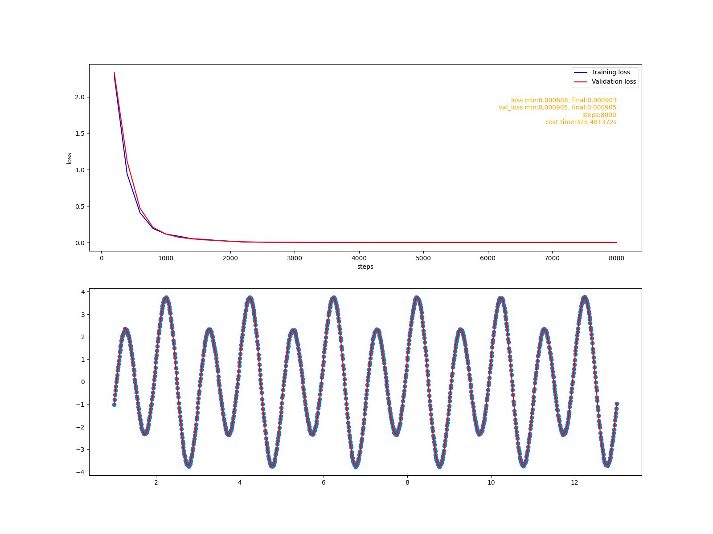

# 目标
&nbsp; &nbsp; &nbsp; &nbsp; 这个阶段会给cute-dl添加循环层，使之能够支持RNN--循环神经网络. 具体目标包括:
1. 添加激活函数sigmoid, tanh.
2. 添加GRU(Gate Recurrent Unit)实现.
3. 添加LSTM(Long Short-term Memory)实现.
4. 使用基于GRU和LSTM的RNN模型拟合一个正余弦叠加函数.


# RNN原理
## 原始的RNN
&nbsp; &nbsp; &nbsp; &nbsp; RNN模型用来捕捉序列数据的特征. 给定一个长度为T的输入系列$X=(x_1, x_2, .., X_T)$, RNN层输出一个长度为T的序列$H=(h_1, h_2, ..., H_T)$, 对于任意时间步t, 可以表示为:
$$
H_t = δ(X_tW_x + H_{t-1}W_h + b), \quad t = 2, 3, .., T
$$
&nbsp; &nbsp; &nbsp; &nbsp; 函数δ是sigmoid函数:
$$
δ = \frac{1}{1 + e^{-x}}
$$
&nbsp; &nbsp; &nbsp; &nbsp; $H_t$包含了前面第1到t-1步的所有信息。 和CNN层类似, CNN层在空间上共享参数， RNN层在时间步上共享参数$W_x, W_h, b$.

&nbsp; &nbsp; &nbsp; &nbsp; RNN层中隐藏层的数量为T-2, 如果T较大(超过10), 反向传播是很容易出现梯度爆炸. GRU和LSTM就是为了解决这个问题而诞生, 这两种模型，可以让RNN能够支持长度超过1000的输入序列。

## GRU
&nbsp; &nbsp; &nbsp; &nbsp; GRU使用了不同功能的门控单元, 分别捕捉序列上不同时间跨度的的依赖关系。每个门控单元都会都有独立的参数, 这些参数在时间步上共享。

&nbsp; &nbsp; &nbsp; &nbsp;  GRU的门控单元有:<br>
&nbsp; &nbsp; &nbsp; &nbsp; $R_t = δ(X_tW^r_x + H_{t-1}W^r_h + b^r)$, 重置门用于捕捉短期依赖关系.<br>
&nbsp; &nbsp; &nbsp; &nbsp; $U_t = δ(X_tW^u_x + H_{t-1}W^u_h + b^u)$, 更新门用于捕捉长期依赖关系<br>
&nbsp; &nbsp; &nbsp; &nbsp; $\bar{H}_t = tanh(X_t\bar{W}_x + (R_t * H_{t-1})\bar{W}_h + \bar{b})$<br>
&nbsp; &nbsp; &nbsp; &nbsp; 除此之外, 还有一个输出单元:<br>
&nbsp; &nbsp; &nbsp; &nbsp; $H_t = U_t * H_{t-1} + (1-U_t)*\bar{H}_t$ <br>

## LSTM
&nbsp; &nbsp; &nbsp; &nbsp; LSTM的设计思路和GRU类似, 同样使用了多个门控单元:<br>
&nbsp; &nbsp; &nbsp; &nbsp; $I_t = δ(X_tW^i_x + H_{t-1}W^i_h + b^i)$, 输入门，过滤记忆门的输出.<br>
&nbsp; &nbsp; &nbsp; &nbsp; $F_t = δ(X_tW^f_x + H_{t-1}W^f_h + b^f)$, 遗忘门, 过滤前面时间步的记忆.<br>
&nbsp; &nbsp; &nbsp; &nbsp; $O_t = δ(X_tW^o_x + H_{t-1}W^o_h + b^o)$, 输出门, 过滤当前时间步的记忆.<br>
&nbsp; &nbsp; &nbsp; &nbsp; $M_t = tanh(X_tW^m_x + H_{t-1}W^m_h + b^m)$, 记忆门.<br>
&nbsp; &nbsp; &nbsp; &nbsp; 它还有自己独有的记忆单元和输出单元:<br>
&nbsp; &nbsp; &nbsp; &nbsp; $\bar{M}_t = F_t * \bar{M}_{t-1} + I_t  * M_t$<br>
&nbsp; &nbsp; &nbsp; &nbsp; $H_t = O_t * tanh(\bar{M}_t)$<r>

# RNN实现
&nbsp; &nbsp; &nbsp; &nbsp; **设计要求**:
1. RNN层中的隐藏层的数量是基于序列长度的，输入序列有多长, RNN层应生成对应数量的隐藏层。
2. RNN层在时间步上共享参数, 从前面的描述可以看出, 只有门控单元有参数，因此门控单元应独立实现。
3. 任意一个时间步上的层都依赖上一个时间步的输出，在正向传播和反向传播过程中都需要上一个时间步的输出, 每个门控单元都使用栈保存上一个时间步的输出.
4. 默认情况下RNN层输出所有时间步的输出。但有时只需要最后一个时间步的输出, 这种情况下使用过滤层, 只向下一层传播最后一个时间步的输出。
5. 使用门控单元实现GRU和LSTM

## RNN基础类的实现
### RNN类
&nbsp; &nbsp; &nbsp; &nbsp; 文件: cutedl/rnn_layers.py, 类名: RNN <br>
&nbsp; &nbsp; &nbsp; &nbsp; 这个类是RNN层基类, 它主要功能是控制向前传播和向后传播的主流程.<br>
&nbsp; &nbsp; &nbsp; &nbsp; 初始化参数:
```python
  '''
  out_units 输出单元数
  in_units 输入单元数
  stateful 保留当前批次的最后一个时间步的状态作为下一个批次的输入状态, 默认False不保留

  RNN 的输入形状是(m, t, in_units)
  m: batch_size
  t: 输入系列的长度
  in_units: 输入单元数页是输入向量的维数

  输出形状是(m, t, out_units)
  '''
  def __init__(self, out_units, in_units=None, stateful=False, activation='linear'):
```
&nbsp; &nbsp; &nbsp; &nbsp; 向前传播
```python
def forward(self, in_batch, training):
    m, T, n = in_batch.shape
    out_units = self.__out_units
    #所有时间步的输出
    hstatus = np.zeros((m, T, out_units))
    #上一步的输出
    pre_hs = self.__pre_hs
    if pre_hs is None:
        pre_hs = np.zeros((m, out_units))

    #隐藏层循环过程, 沿时间步执行
    for t in range(T):
        hstatus[:, t, :] = self.hiden_forward(in_batch[:,t,:], pre_hs, training)
        pre_hs = hstatus[:, t, :]

    self.__pre_hs = pre_hs
    #pdb.set_trace()
    if not self.stateful:
        self.__pre_hs = None

    return hstatus
```

&nbsp; &nbsp; &nbsp; &nbsp; 反向传播
```python
def backward(self, gradient):
      m, T, n = gradient.shape

      in_units = self.__in_units
      grad_x = np.zeros((m, T, in_units))
      #pdb.set_trace()
      #从最后一个梯度开始反向执行.
      for t in range(T-1, -1, -1):
          grad_x[:,t,:], grad_hs = self.hiden_backward(gradient[:,t,:])
          #pdb.set_trace()
          if t - 1 >= 0:
              gradient[:,t-1,:] = gradient[:,t-1,:] + grad_hs

      #pdb.set_trace()
      return grad_x
```

## sigmoid和tanh激活函数
### sigmoid及其导数
$$
sigmoid = \frac{1}{1+e^{-x}}
$$
$$
\frac{d}{dx}sigmoid = sigmoid(1-sigmoid)
$$

### tanh及其导数
$$
tanh = \frac{e^x - e^{-x}}{e^x + e^{-x}}
$$
$$
\frac{d}{dx}tanh = 1 - tanh^2
$$


## 门控单元实现
&nbsp; &nbsp; &nbsp; &nbsp; 文件: cutedl/rnn_layers.py, 类名: GateUint <br>
&nbsp; &nbsp; &nbsp; &nbsp; 门控单元是RNN层基础的参数单元. 和Dense层类似，它是Layer的子类，负责学习和使用参数。但在学习和使用参数的方式上有很大的不同:
- Dense有两个参数矩阵, GateUnit有3个参数矩阵.
- Dense在一次反向传播过程中只使用当前的梯度学习参数，而GateUnit会累积每个时间步的梯度。

&nbsp; &nbsp; &nbsp; &nbsp; 下面我们会主要看一下GateUnit特别之处的代码.<br>
&nbsp; &nbsp; &nbsp; &nbsp; 在__ init__方法中定义参数和栈:
```python
    #3个参数
    self.__W = None #当前时间步in_batch权重参数
    self.__Wh = None #上一步输出的权重参数
    self.__b = None #偏置量参数

    #输入栈
    self.__hs = []  #上一步输出
    self.__in_batchs = [] #当前时间步的in_batch
```
&nbsp; &nbsp; &nbsp; &nbsp; 正向传播：
```python
  def forward(self, in_batch, hs, training):
      W = self.__W.value
      b = self.__b.value
      Wh = self.__Wh.value

      out = in_batch @ W + hs @ Wh + b

      if training:
          #向前传播训练时把上一个时间步的输出和当前时间步的in_batch压栈
          self.__hs.append(hs)
          self.__in_batchs.append(in_batch)

          #确保反向传播开始时参数的梯度为空
          self.__W.gradient = None
          self.__Wh.gradient = None
          self.__b.gradient = None

      return self.activation(out)
```
&nbsp; &nbsp; &nbsp; &nbsp; 反向传播:
```python
def backward(self, gradient):
    grad = self.activation.grad(gradient)

    W = self.__W.value
    Wh = self.__Wh.value
    pre_hs = self.__hs.pop()
    in_batch = self.__in_batchs.pop()

    grad_in_batch = grad @ W.T
    grad_W = in_batch.T @ grad
    grad_hs = grad @ Wh.T
    grad_Wh = pre_hs.T @ grad
    grad_b = grad.sum(axis=0)

    #反向传播计算
    if self.__W.gradient is None:
        #当前批次第一次
        self.__W.gradient = grad_W
    else:
        #累积当前批次的所有梯度
        self.__W.gradient = self.__W.gradient + grad_W

    if self.__Wh.gradient is None:
        self.__Wh.gradient = grad_Wh
    else:
        self.__Wh.gradient = self.__Wh.gradient +  grad_Wh

    if self.__b.gradient is None:
        self.__b.gradient = grad_b
    else:
        self.__b.gradient = self.__b.gradient + grad_b

    return grad_in_batch, grad_hs
```

## GRU实现
&nbsp; &nbsp; &nbsp; &nbsp; 文件: cutedl/rnn_layers.py, 类名: GRU <br>
&nbsp; &nbsp; &nbsp; &nbsp; 隐藏单初始化:
```python
def set_parent(self, parent):
    super().set_parent(parent)

    out_units = self.out_units
    in_units = self.in_units

    #pdb.set_trace()
    #重置门
    self.__g_reset = GateUnit(out_units, in_units)
    #更新门
    self.__g_update = GateUnit(out_units, in_units)
    #候选输出门
    self.__g_cddout = GateUnit(out_units, in_units, activation='tanh')

    self.__g_reset.set_parent(self)
    self.__g_update.set_parent(self)
    self.__g_cddout.set_parent(self)

    #重置门乘法单元
    self.__u_gr = MultiplyUnit()
    #输出单元
    self.__u_out = GRUOutUnit()
```
&nbsp; &nbsp; &nbsp; &nbsp; 向前传播:
```python
  def hiden_forward(self, in_batch, pre_hs, training):
      gr = self.__g_reset.forward(in_batch, pre_hs, training)
      gu = self.__g_update.forward(in_batch, pre_hs, training)
      ugr = self.__u_gr.forward(gr, pre_hs, training)
      cddo = self.__g_cddout.forward(in_batch, ugr, training)

      hs = self.__u_out.forward(gu, pre_hs, cddo, training)

      return hs
```
&nbsp; &nbsp; &nbsp; &nbsp; 反向传播:
```python
def hiden_backward(self, gradient):

    grad_gu, grad_pre_hs, grad_cddo = self.__u_out.backward(gradient)
    #pdb.set_trace()
    grad_in_batch, grad_ugr = self.__g_cddout.backward(grad_cddo)

    #计算梯度的过程中需要累积上一层输出的梯度
    grad_gr, g_pre_hs = self.__u_gr.backward(grad_ugr)
    grad_pre_hs = grad_pre_hs + g_pre_hs

    g_in_batch, g_pre_hs = self.__g_update.backward(grad_gu)
    grad_in_batch = grad_in_batch + g_in_batch
    grad_pre_hs = grad_pre_hs + g_pre_hs

    g_in_batch, g_pre_hs = self.__g_reset.backward(grad_gr)
    grad_in_batch = grad_in_batch + g_in_batch
    grad_pre_hs = grad_pre_hs + g_pre_hs

    #pdb.set_trace()
    return grad_in_batch, grad_pre_hs    
```

## LSTM实现
&nbsp; &nbsp; &nbsp; &nbsp; 文件: cutedl/rnn_layers.py, 类名: LSTM <br>

&nbsp; &nbsp; &nbsp; &nbsp; 隐藏单元初始化:
```python
def set_parent(self, layer):
    super().set_parent(layer)

    in_units = self.in_units
    out_units = self.out_units

    #输入门
    self.__g_in = GateUnit(out_units, in_units)
    #遗忘门
    self.__g_forget = GateUnit(out_units, in_units)
    #输出门
    self.__g_out = GateUnit(out_units, in_units)
    #记忆门
    self.__g_memory = GateUnit(out_units, in_units, activation='tanh')

    self.__g_in.set_parent(self)
    self.__g_forget.set_parent(self)
    self.__g_out.set_parent(self)
    self.__g_memory.set_parent(self)

    #记忆单元
    self.__memory_unit =LSTMMemoryUnit()
    #输出单元
    self.__out_unit = LSTMOutUnit()
```
&nbsp; &nbsp; &nbsp; &nbsp; 向前传播:
```python
def hiden_forward(self, in_batch, hs, training):
    g_in = self.__g_in.forward(in_batch, hs, training)
    #pdb.set_trace()
    g_forget = self.__g_forget.forward(in_batch, hs, training)
    g_out = self.__g_out.forward(in_batch, hs, training)
    g_memory = self.__g_memory.forward(in_batch, hs, training)

    memory = self.__memory_unit.forward(g_forget, g_in, g_memory, training)
    cur_hs = self.__out_unit.forward(g_out, memory, training)

    return cur_hs
```
&nbsp; &nbsp; &nbsp; &nbsp; 反向传播:
```python
def hiden_backward(self, gradient):
    #pdb.set_trace()
    grad_out, grad_memory = self.__out_unit.backward(gradient)
    grad_forget, grad_in, grad_gm = self.__memory_unit.backward(grad_memory)

    grad_in_batch, grad_hs = self.__g_memory.backward(grad_gm)
    tmp1, tmp2 = self.__g_out.backward(grad_out)
    grad_in_batch += tmp1
    grad_hs += tmp2

    tmp1, tmp2 = self.__g_forget.backward(grad_forget)
    grad_in_batch += tmp1
    grad_hs += tmp2

    tmp1, tmp2 = self.__g_in.backward(grad_in)
    grad_in_batch += tmp1
    grad_hs += tmp2

    return grad_in_batch, grad_hs
```

# 验证
&nbsp; &nbsp; &nbsp; &nbsp; 接下来, 验证示例将会构建一个简单的RNN模型, 使用该模型拟合一个正余弦叠加函数:
```python
#采样函数
def sample_function(x):
    y = 3*np.sin(2 * x * np.pi) + np.cos(x * np.pi) + np.random.uniform(-0.05,0.05,len(x))
    return y
```
&nbsp; &nbsp; &nbsp; &nbsp; 训练数据集和测试数据集在这个函数的不同定义域区间内采样. 训练数据集的采样区间为[1, 200.01), 测试数据集的采样区间为[200.02, 240.002). 模型任务是预测这个函数值的序列.

 &nbsp; &nbsp; &nbsp; &nbsp; 示例代码在examples/rnn/fit_function.py文件中.

## 使用GRU构建的模型
```python
def fit_gru():
    model = Model([
                rnn.GRU(32, 1),
                nn.Filter(),
                nn.Dense(32),
                nn.Dense(1, activation='linear')
            ])
    model.assemble()
    fit('gru', model)
```
训练报告:


## 使用LSTM构建的模型
```python
def fit_lstm():
    model = Model([
                rnn.LSTM(32, 1),
                nn.Filter(),
                nn.Dense(2),
                nn.Dense(1, activation='linear')
            ])
    model.assemble()
    fit('lstm', model)
```
训练报告:


## 总结
&nbsp; &nbsp; &nbsp; &nbsp; 这个阶段，框架新增了RNN的两个最常见的实现:GRU和LSTM, 相应地增加了它需要的激活函数. cute-dl已经具备了构建最基础RNN模型的能力。通过验证发现, GRU模型和LSTM模型在简单任务上都表现出了很好的性能。会添加嵌入层，使框架能够构建文本分类任务的模型，然后在imdb-review(电影评价)数据集上进行验证.
