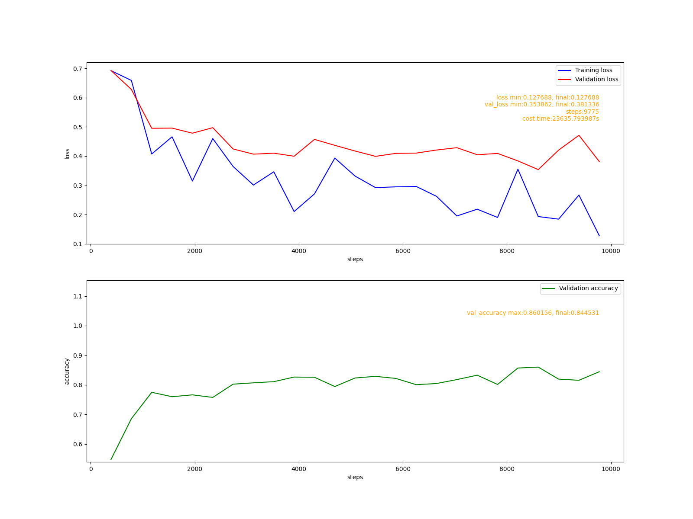

<head>
    <script src="https://cdn.mathjax.org/mathjax/latest/MathJax.js?config=TeX-AMS-MML_HTMLorMML" type="text/javascript"></script>
    <script type="text/x-mathjax-config">
        MathJax.Hub.Config({
            tex2jax: {
            skipTags: ['script', 'noscript', 'style', 'textarea', 'pre'],
            inlineMath: [['$','$']]
            }
        });
    </script>
</head>


# 目标
&nbsp; &nbsp; &nbsp; &nbsp; 上阶段cute-dl已经可以构建基础的RNN模型。但对文本相模型的支持不够友好, 这个阶段的目标是, 让框架能够友好地支持文本分类和本文生成任务。具体包括:
1. 添加嵌入层, 为文本寻找高效的向量表示。
2. 添加类别抽样函数, 根据模型输出的类别分布抽样得到生成的文本。
3. 使用imdb-review数据集验证文本分类模型。
4. 使用一个古诗数据集验证文本生成模型。

&nbsp; &nbsp; &nbsp; &nbsp; 这阶段涉及到的代码比较简单因此接下来会重点描述RNN语言相关模型中涉及到的数学原理和工程方法。

# 数学原理
## 文本分类模型
&nbsp; &nbsp; &nbsp; &nbsp; 可以把文本看成是一个词的序列$W=[w_1, w_2, ..., w_T]$, 在训练数据集中每个文本属于一个类别$a_i$, $a_i∈A$, 集合$A=\{ a_1, a_2, a_3, ..., a_k \}$是一个类别别集合. 分类模型要做的是给定一个文本W, 计算所有类别的后验概率:
$$
P(a_i|W) = P(a_i|w_1,w_2,...,w_T), \quad i=1,2,...k
$$
&nbsp; &nbsp; &nbsp; &nbsp; 那么文本序列W的类别为:
$$
a = arg \max_{a_i} P(a_i|w_1,w_2,...,w_T)
$$
&nbsp; &nbsp; &nbsp; &nbsp;  即在给定文本的条件下, 具有最大后验概率的类别就是文本序列W所属的类别.

## 文本预测模型
&nbsp; &nbsp; &nbsp; &nbsp; 设任意一个文本序列为$W=[w_1,w_2,...,W_T]$, 任意一个词$w_i ∈ V$, V是所有词汇的集合，也叫词汇表, 这里需要强调的是$w_i$在V中是无序的, 但在W中是有序的, 文本预测的任务是, 计算任意一个词$w_i ∈ V$在给定一个序列中的任意一个位置出现的概率:
$$
P(w_1,...,W_T) = ∏_{t=1}^T P(w_t|w_1,...,w_{T-1})
$$
&nbsp; &nbsp; &nbsp; &nbsp; 文本预测最终处于一个$w_i ∈ V$的分布列, 根据这个分布列从V中抽取一个词即为预测结果。不同于分类任务，这里是取概率最大的词, 这里的预测结果是某个词出现的在一个序列特定位置的个概率，只要概率不是0都有可能出现，所以要用抽样的方法确定某次预测的结果。

# 词的数字化表示
&nbsp; &nbsp; &nbsp; &nbsp; 任意一条数据在送入模型之前都要表示为一个数字化的向量, 文本数据也不例外。一个文本可以看成词的序列，因此只要把词数字化了，文本自然也就数字化了。对于词来说，最简单的方式是用词在词汇表中的唯一ID来表示, ID需要遵守两个最基本的规则:
1. 每个词的ID在词汇表中必须是唯一的.
2. 每个词的ID一旦确定不能变化.

&nbsp; &nbsp; &nbsp; &nbsp; 这种表示很难表达词之间的关系, 例如: 在词汇表中把"好"的ID指定为100, 如果希望ID能够反映词意的关系, 需要把"好"的近意词: "善", "美", "良", "可以"编码为98, 99, 101, 102. 目前为止这看起还行. 如果还希望ID能够反映词之间的语法关系, "好"前后经常出现的词: "友", "人", "的", 这几个词的ID就很难选择, 不论怎样, 都会发现两个词它们在语义和语法上的关系都很远，但ID却很接近。这也说明了标量的表达能力很有限，无法表达多个维度的关系。为了能够表达词之间多个维度的的关系，多维向量是一个很好的选择. 向量之间之间的夹大小衡量它们之间的关系:
$$
cos(θ) = \frac{<A, B>}{|A||B|}
$$
&nbsp; &nbsp; &nbsp; &nbsp; 对于两个向量A, B使用它们的点积, 模的乘积就能得到夹角θ余弦值。当cos(θ)->1表示两个向量的相似度高, cos(θ)->0 表示两个向量是不相关的, cos(θ)->-1 表示两个向量是相反的。

&nbsp; &nbsp; &nbsp; &nbsp; 把词的ID转换成向量，最简单的办法是使用one-hot编码, 这样得到的向量有两个问题:
1. 任意两个向量A,B, <A,B>=0, 夹角的余弦值cos(θ)=0, 不能表达词之间的关系.
2. 向量的维度等于词汇表的大小, 而且是稀疏向量，这和导致模型有大量的参数，模型训练过程的运算量也很大.

&nbsp; &nbsp; &nbsp; &nbsp; 词嵌入技术就是为解决词表示的问题而提出的。词嵌入把词ID映射到一个合适维度的向量空间中, 在这个向量空间中为每个ID分配一个唯一的向量, 把这些向量当成参数看待, 在特定任务的模型中学习这些参数。当模型训练完成后, 这些向量就是词在这个特定任务中的一个合适的表示。词嵌入向量的训练步骤有:
1. 收集训练数据集中的词汇, 构建词汇表。
2. 为词汇表中的每个词分配一个唯一的ID。假设词汇表中的词汇量是N, 词ID的取值为:0,1,2,...,N-1, 对人任意一个0<ID<N-1, 必然存在ID-1, ID+1.
3. 随机初始化N个D维嵌入向量, 向量的索引为0,1,2,...,N-1. 这样词ID就成了向量的索引.
4. 定义一个模型, 把嵌入向量作为模型的输入层参与训练.
5. 训练模型.


# 嵌入层实现
&nbsp; &nbsp; &nbsp; &nbsp; 代码: cutedl/rnn_layers.py, Embedding类.

&nbsp; &nbsp; &nbsp; &nbsp; 初始化嵌入向量, 嵌入向量使用(-1, 1)区间均匀分布的随机变量初始化:
```python
'''
dims 嵌入向量维数
vocabulary_size 词汇表大小
need_train 是否需要训练嵌入向量
'''
def __init__(self, dims, vocabulary_size, need_train=True):
    #初始化嵌入向量
    initializer = self.weight_initializers['uniform']
    self.__vecs = initializer((vocabulary_size, dims))

    super().__init__()

    self.__params = None
    if need_train:
        self.__params = []
        self.__cur_params = None
        self.__in_batch = None
```
&nbsp; &nbsp; &nbsp; &nbsp; 初始化层参数时把所有的嵌入向量变成参与训练的参数:
```python
def init_params(self):
    if self.__params is None:
        return

    voc_size, _ = self.__vecs.shape
    for i in range(voc_size):
        pname = 'weight_%d'%i
        p = LayerParam(self.name, pname, self.__vecs[i])
        self.__params.append(p)
```
&nbsp; &nbsp; &nbsp; &nbsp; 向前传播时, 把形状为(m, t)的数据转换成(m, t, n)形状的数据, 其中t是序列长度, n是嵌入向量的维数.
```python
'''
in_batch shape=(m, T)
return shape (m, T, dims)
'''
def forward(self, in_batch, training):
    m,T = in_batch.shape
    outshape = (m, T, self.outshape[-1])
    out = np.zeros(outshape)

    #得到每个序列的嵌入向量表示
    for i in range(m):
        out[i] = self.__vecs[in_batch[i]]

    if training and self.__params is not None:
        self.__in_batch = in_batch

    return out
```
&nbsp; &nbsp; &nbsp; &nbsp; 反向传播时只关注当前批次使用到的向量, 注意同一个向量可能被多次使用, 需要累加同一个嵌入向量的梯度.
```python
def backward(self, gradient):
    if self.__params is None:
        return

    #pdb.set_trace()
    in_batch = self.__in_batch
    params = {}
    m, T, _ = gradient.shape
    for i in range(m):
        for t in range(T):
            grad = gradient[i, t]
            idx = self.__in_batch[i, t]

            #更新当前训练批次的梯度
            if idx not in params:
                #当前批次第一次发现该嵌入向量
                params[idx] = self.__params[idx]
                params[idx].gradient = grad
            else:
                #累加当前批次梯度
                params[idx].gradient += grad

    self.__cur_params = list(params.values())
```

# 验证

## imdb-review数据集上的分类模型
&nbsp; &nbsp; &nbsp; &nbsp; 代码: examples/rnn/text_classify.py.
### 数据集处理
&nbsp; &nbsp; &nbsp; &nbsp; 数据集处理时有几个需要注意的地方:
1. imdb-review数据集由长度不同的文本构成, 送入模型的数据形状为(m, t, n), 至少要求一个批次中的数据具有相同的序列长度, 因此在对数据进行分批时, 对数据按批次填充.
2. 一般使用0左为填充编码. 在构建词汇表时, 假设有v个词汇, 词汇的编码为1,2,...,v.
3. 由于对文本进行分词, 编码比较耗时。可以把编码后的数据保存起来，作为数据集的预处理数据, 下次直接加载使用。

### 模型
```python
def fit_gru():
    print("fit gru")
    model = Model([
                rnn.Embedding(64, vocab_size+1),
                wrapper.Bidirectional(rnn.GRU(64), rnn.GRU(64)),
                nn.Filter(),
                nn.Dense(64),
                nn.Dropout(0.5),
                nn.Dense(1, activation='linear')
            ])
    model.assemble()
    fit('gru', model)
```
&nbsp; &nbsp; &nbsp; &nbsp; 训练报告:

这个模型和tensorflow给出的模型略有差别, 少了一个RNN层wrapper.Bidirectional(rnn.GRU(32), rnn.GRU(32)), 这个模型经过16轮的训练达到了tensorflow模型的水平.

## 文本生成模型
&nbsp; &nbsp; &nbsp; &nbsp; 我自己收集了一个古由诗词构成的小型数据集, 用来验证文本生成模型. 代码: examples/rnn/text_gen.py.

&nbsp; &nbsp; &nbsp; &nbsp; 模型定义:
```python
def fit_gru():
    vocab_size = vocab.size()
    model = Model([
                rnn.Embedding(128, vocab_size+1),
                rnn.GRU(128),
                nn.Dense(vocab_size, activation='linear')
            ])

    model.assemble()
    fit("gru", model)
```
&nbsp; &nbsp; &nbsp; &nbsp; 训练报告:


&nbsp; &nbsp; &nbsp; &nbsp; 生成七言诗:
```python
def gen_text():
    mpath = model_path+"gru"

    model = Model.load(mpath)
    outshape = (4, 7)

    def do_gen(txt):
        #编码
        res = vocab.encode(sentence=txt)

        m, n = outshape

        for i in range(m*n - 1):
            in_batch = np.array(res).reshape((1, -1))
            outs = model.predict(in_batch)
            #取最后一维的预测结果
            outs = outs[:, -1]
            #抽样得到生成的一个字
            outs = dlmath.categories_sample(outs, 1)
            #把生成的字放入输入序列中作为下一次的输入.
            res.append(outs[0,0] + 1)

        txt = ""
        for i in range(m):
            txt = txt + vocab.decode(res[i*n:(i+1)*n]) + "\n"

        return txt

    #起始文本
    starts = ['风', '花', '雪', '月']
    #使用每个起始文本生成一首七言诗
    for txt in starts:
        model.reset()
        res = do_gen(txt)
        print(res)
```
