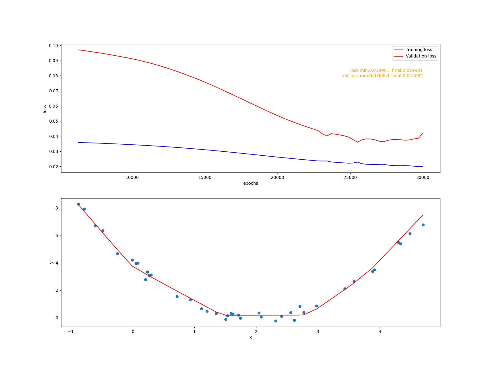

## 模型验证

#### 数据采样函数
```python
def target_func(x):
    #加入(0, 0.25^2)正态分布噪声
    y = (x - 2)**2 + 0.25 * np.random.randn(len(x))
    return y
```
采样区间[-1, 5], 200条数据, 随机选择160条数据作为训练数据集,  剩余40条作为验证数据集.

#### 1 简单的线性模型
模型:<br>
|layer| shape |
| --  | --   |
| 0   | (1, 32)|
| 1   | (32, 1)|


fit_1实现 <br>
线性模型模型无法拟合非线性函数, 呈现欠拟合, 模型复杂度不够

#### 2 简单的非线性模型
模型:<br>
|layer| shape |
| --  | --   |
| 0   | (1, 32)|
| 1   | (32, 1)|


fit_2实现<br>
拟合得比较令人满意.


#### 3 减少训练集数据量, 增加模型复杂度
模型:<br>
|layer| shape |
| --  | --   |
| 0   | (1, 512)|
| 1   | (512, 128)|
| 1   | (128, 1)|

训练数据集只取16条数据


fit_3实现<br>
可以看到, 验证误差到0.44后不仅没有继续减小反而有增大的趋势. 模型呈现过拟合。

#### 4 降低模型复杂度
模型:<br>
|layer| shape |
| --  | --   |
| 0   | (1, 128)|
| 1   | (128, 64)|
| 1   | (64, 1)|



验证误差可以降低0.40左右, 从图形上看欠拟合略有缓解, 但不理想. 后面将会用其他方法在不增加训练数据的情况下进一步缓解过拟合.
